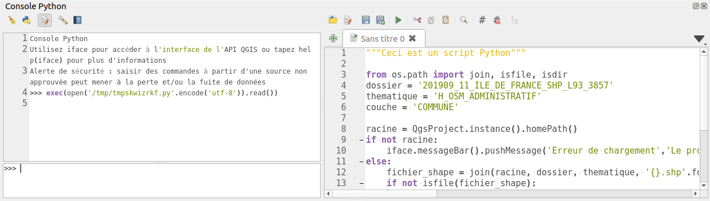

# Utilisation des expressions QGIS

Nous partons de la couche des `COMMUNES` uniquement chargé dans QGIS.

## Sélection d'entité

Nous souhaitons sélectionner les entités dont le code INSEE commence par `77`.
Commençons par faire cela graphiquement dans QGIS Desktop. À l'aide d'une expression QGIS, sélectionner
les codes INSEE qui commencent par `77`.



Nous allons faire la même chose, mais en utilisant Python. Pensez a désélectionner les entités.

```python
layer = iface.activeLayer()
layer.removeSelection()
layer.selectByExpression("\"CODE_INSEE\" LIKE '{}%'".format(77))
layer.invertSelection()
layer.removeSelection()
```

## Boucler sur une expression

L'objectif est d'afficher dans la console le nom des communes dont la population ne contient pas `NC`.

L'exemple à ne pas faire :
```python
layer = iface.activeLayer()
for feature in layer.getFeatures():
    if feature['POPUL'] != 'NC':
        print(feature['NOM'])
```

Utilisons une expression pour limiter les résultats et ordonner les résultats.
Observez bien la signature de la fonction `getFeatures`. Que remarquez-vous?

```python
request = QgsFeatureRequest()
request.setFilterExpression('"POPUL" != \'NC\'')
request.addOrderBy('NOM')
for feature in layer.getFeatures(request):
    print('{commune} : {nombre} habitants pour'.format(commune=feature['NOM'], nombre=feature['POPUL']))
```

Nous pouvons encore optimiser la requête :
```python
request = QgsFeatureRequest()
request.setFilterExpression('"POPUL" != \'NC\'')
request.addOrderBy('NOM')
request.setFlags(QgsFeatureRequest.NoGeometry)
request.setSubsetOfAttributes([1, 4])
for feature in layer.getFeatures(request):
    print('{commune} : {nombre} habitants'.format(commune=feature['NOM'], nombre=feature['POPUL']))
```

Faire le test en affichant un champ qui n'est pas dans la requête.

Rajoutons un intersection spatial avec l'emprise suivante:
```python
request.setFilterRect(QgsRectangle(662737,6807733,717144,6853979))
```

Mettons ce résultat dans une nouvelle couche :
```python
memory_layer = layer.materialize(request)
QgsProject.instance().addMapLayer(memory_layer)
```

Corrigeons ce problème d'export afin d'obtenir les géométries et les attributs:
```python
request.setFlags(QgsFeatureRequest.NoFlags)
```

Avant dernier exercice, afficher une liste des communes dont la population est inférieur
à 1000 habitants en incluant la densité de population.

```python
layer = iface.activeLayer()
request = QgsFeatureRequest()
request.setFilterExpression('to_int( "POPUL" ) < 1000')
request.addOrderBy('NOM')
request.setSubsetOfAttributes([1, 4])
for feature in layer.getFeatures(request):
    area = feature.geometry().area() / 1000000
    print(area)
    try:
        population = int(feature['POPUL'])
    except ValueError:
        population = 0
    print('{commune} : {densite} habitants/km²'.format(commune=feature['NOM'], densite=population/area))
```

Nous souhaitons enregistrer ces informations dans un table séparé avec un nouveau champ `densite`.
```python
layer = iface.activeLayer()

request = QgsFeatureRequest()
request.setFilterExpression('to_int( "POPUL" ) < 1000')
petites_communes = layer.materialize(request)

with edit(petites_communes):
    field = QgsField('densite', QVariant.Double)
    petites_communes.addAttribute(field)

request = QgsFeatureRequest()
request.setSubsetOfAttributes([4])
with edit(petites_communes):
    for feature in petites_communes.getFeatures(request):
        area = feature.geometry().area() / 1000000
        population = int(feature['POPUL'])
        densite=population/area
        petites_communes.changeAttributeValue(feature.id(), 5, densite)

QgsProject.instance().addMapLayer(petites_communes)
```

Manipulons désormais la géométrie en ajoutant le centroïde de la commune dans une colonne `latitude` et `longitude` en degrées.

```python
layer = iface.activeLayer()

request = QgsFeatureRequest()
request.setFilterExpression('to_int( "POPUL" ) < 1000')
petites_communes = layer.materialize(request)

with edit(petites_communes):
    petites_communes.addAttribute(QgsField('densite', QVariant.Double))
    petites_communes.addAttribute(QgsField('longitude', QVariant.Double))
    petites_communes.addAttribute(QgsField('latitude', QVariant.Double))

request = QgsFeatureRequest()
request.setSubsetOfAttributes([4])
transform = QgsCoordinateTransform(QgsCoordinateReferenceSystem(2154), QgsCoordinateReferenceSystem(4326), QgsProject.instance())
with edit(petites_communes):
    for feature in petites_communes.getFeatures(request):
        area = feature.geometry().area() / 1000000
        population = int(feature['POPUL'])
        densite=population/area
        petites_communes.changeAttributeValue(feature.id(), 5, densite)
        geom = feature.geometry()
        geom.transform(transform)
        centroid = geom.centroid().asPoint()
        petites_communes.changeAttributeValue(feature.id(), 6, centroid.x())
        petites_communes.changeAttributeValue(feature.id(), 7, centroid.y())

QgsProject.instance().addMapLayer(petites_communes)
```