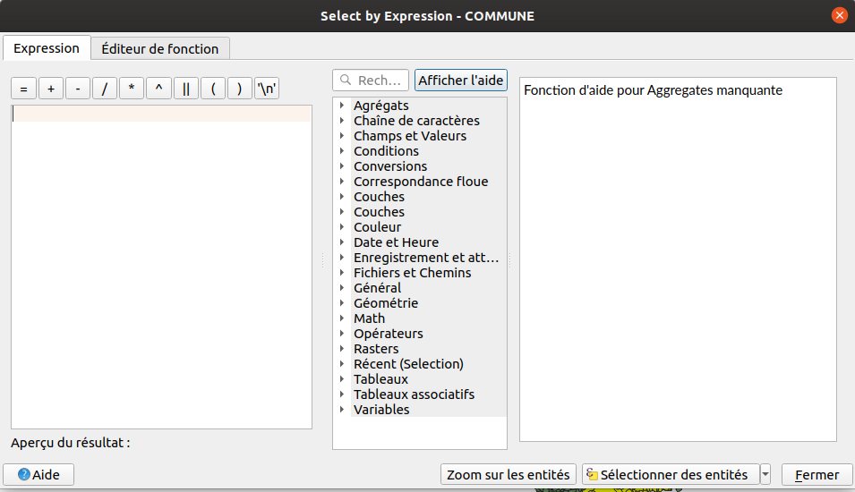

---
Title: Sélections, fonctions
Favicon: logo.png
Index: True
...

[TOC]

# Boucler sur les entités d'une couche sans expression

On peut parcourir les entités d'une couche `QgsVectorLayer` à l'aide de `getFeatures()` :

```python
layer = iface.activeLayer()
for feature in layer.getFeatures():
    print(feature)
    print(feature['NOM'])
```

# Utilisation des expressions QGIS

* Les expressions sont très présentes dans QGIS, tant dans l'interface graphique que dans l'utilisation en
  Python.
* Nous partons de la couche des `COMMUNES` uniquement chargé dans QGIS.

## Sélection d'entité

Nous souhaitons sélectionner les entités dont le code INSEE commence par `77`.
Commençons par faire cela graphiquement dans QGIS Desktop. À l'aide d'une expression QGIS, sélectionner
les codes INSEE qui commencent par `77` (à choisir un code INSEE propre au jeu de données).



Solution en mode graphique :

```
"CODE_INSEE" LIKE '77%'
```

Nous allons faire la même chose, mais en utilisant Python. Pensez à **désélectionner** les entités.

```python
layer = iface.activeLayer()
layer.removeSelection()
layer.selectByExpression("\"CODE_INSEE\" LIKE '{}%'".format(77))
layer.invertSelection()
layer.removeSelection()
```

## Boucler sur les entités à l'aide d'une expression

L'objectif est d'afficher dans la console le nom des communes dont la population ne contient pas `NC`.

**Note**, en PyQGIS, on peut accéder aux attributs d'une `QgsFeature` simplement avec l'opérateur `[]` sur 
l'objet courant comme s'il s'agissait d'une liste Python :

L'exemple à **ne pas** faire, même si cela fonctionne :

```python
layer = iface.activeLayer()
for feature in layer.getFeatures():
    if feature['POPUL'] != 'NC':
        print(feature['NOM'])
```

Dans la documentation, observez bien la signature de la fonction `getFeatures`. Que remarquez-vous ?
Utilisons donc une expression pour limiter les résultats.

```python
request = QgsFeatureRequest(QgsExpression('"POPUL" != \'NC\''))
for feature in layer.getFeatures(request):
    print('{commune} : {nombre} habitants pour'.format(commune=feature['NOM'], nombre=feature['POPUL']))
```

Nous pouvons accessoirement ordonner les résultats et surtout encore optimiser la requête en :

  * Ne demandant pas de charger la géométrie
  * Ne demandant pas de charger tous les attributs

```python
request = QgsFeatureRequest()
request.setFilterExpression('"POPUL" != \'NC\'')
request.addOrderBy('NOM')
request.setFlags(QgsFeatureRequest.NoGeometry)
request.setSubsetOfAttributes([1, 4])
for feature in layer.getFeatures(request):
    print('{commune} : {nombre} habitants'.format(commune=feature['NOM'], nombre=feature['POPUL']))
```

Faire le test en affichant un champ qui n'est pas dans la requête.

Rajoutons une intersection spatiale avec l'emprise suivante :
```python
request.setFilterRect(QgsRectangle(662737, 6807733, 717144, 6853979))
```

Si l'on souhaite "enregistrer" le résultat de cette expression QGIS, on peut la *matérialiser* dans une
nouvelle couche :

```python
memory_layer = layer.materialize(request)
QgsProject.instance().addMapLayer(memory_layer)
```

Regardons le résultat et corrigeons ce problème d'export afin d'obtenir les géométries et les attributs :
```python
request.setFlags(QgsFeatureRequest.NoFlags)
```

Avant-dernier exercice, afficher une liste des communes dont la population est inférieur
à 1000 habitants en incluant la densité de population.

### Les exceptions en Python

Avant de traiter cet exercice, nous devons voir ce qu'est une **exception** en Python.

À plusieurs reprises depuis le début de la formation, il est fort à parier que nous ayons des messages en
rouges dans la console de temps en temps. Ce sont des exceptions. C'est une notion de programmation qui existe
dans beaucoup de languages.

Dans le language informatique, une exception peut-être :

* levé (raise en anglais) pour déclencher une erreur
* attrapé (catch en anglais) pour traiter l'erreur

Essayons dans la console de faire une l'opération 10 / 2 :

```python
10 / 2
```

Essayons cette fois-ci 10 / 0, ce qui est mathématiquement impossible :
```python
10 / 0
```

On peut "attraper" cette erreur Python à l'aide d'un `try ... except...` :

```python
try:
    10 / 2
except ZeroDivisionError:
    print('Ceci est une division par zéro !')
```

Le `try` permet d'essayer le code qui suit. Le `except` permet d'attraper en filtrant s'il y a des exceptions
et de traiter l'erreur si besoin.

Toutes les exceptions héritent de `Exception` donc le code ci-dessous fonctionne, mais n'est pas
recommandé car il masque d'autres erreurs :

```python
try:
    10 / 2
except Exception:
    print('Ceci est une division par zéro !')
```

On peut imaginer faire une fonction qui divise deux nombres et affiche le résultat dans la QgsMessageBar de 
QGIS, sans tenir compte de la division par zéro :

```python
def diviser(a, b):
    result = a / b
    iface.messageBar().pushMessage('Résulat', f'{a} / {b} = {result}', Qgis.Success)
    
diviser(10, 0)
```

En tenant compte d'une possible erreur lors de l'opération mathématique :

```python
def diviser(a, b):
    try:
        result = a / b
    except ZeroDivisionError:
        iface.messageBar().pushMessage('Division par 0', f'{a} / {b} est impossible', Qgis.Warning)
    else:
        iface.messageBar().pushMessage('Résulat', f'{a} / {b} = {result}', Qgis.Success)
    
diviser(10, 2)
```

Évidement, on peut vérifier la valeur de `b` en amont si c'est égal à 0. Mais ceci est pour présenter le
concept des exceptions en Python.

### Retour à l'exercice

On souhaite donc savoir si un nombre est transformable en entier, dans le cas de la
population (s'il y a `NC` par exemple) :

```python
int('10')
int('NC')
```

Correction possible de l'exercice :

```python
layer = iface.activeLayer()
request = QgsFeatureRequest()
# request.setFilterExpression('to_int( "POPUL" ) < 1000')
request.addOrderBy('NOM')
request.setSubsetOfAttributes([1, 4])
for feature in layer.getFeatures(request):
    area = feature.geometry().area() / 1000000
    try:
        population = int(feature['POPUL'])
    except ValueError:
        population = 0
    print('{commune} : {densite} habitants/km²'.format(commune=feature['NOM'], densite=population/area))
```

Nous souhaitons enregistrer ces informations dans une vraie table avec un nouveau champ `densite_population`.

```python
layer = iface.activeLayer()

request = QgsFeatureRequest()
request.setFilterExpression('to_int( "POPUL" ) < 1000')
petites_communes = layer.materialize(request)

with edit(petites_communes):
    field = QgsField('densite_population', QVariant.Double)
    petites_communes.addAttribute(field)

request = QgsFeatureRequest()
request.setSubsetOfAttributes([4])

with edit(petites_communes):
    for feature in petites_communes.getFeatures(request):
        area = feature.geometry().area() / 1000000
        population = int(feature['POPUL'])
        densite=population/area
        petites_communes.changeAttributeValue(feature.id(), 5, densite)

QgsProject.instance().addMapLayer(petites_communes)
```

Manipulons désormais la géométrie en ajoutant le centroïde de la commune dans une colonne `latitude` et
`longitude` en degrées.

```python
layer = iface.activeLayer()

request = QgsFeatureRequest()
request.setFilterExpression('to_int( "POPUL" ) < 1000')
petites_communes = layer.materialize(request)

with edit(petites_communes):
    petites_communes.addAttribute(QgsField('densite_population', QVariant.Double))

    # /!\ Ajouter les 2 lignes ci-dessous
    petites_communes.addAttribute(QgsField('longitude', QVariant.Double))
    petites_communes.addAttribute(QgsField('latitude', QVariant.Double))

request = QgsFeatureRequest()
request.setSubsetOfAttributes([4])

# /!\ Ajouter les 2 lignes ci-dessous à propos de la transformation
transform = QgsCoordinateTransform(
    QgsCoordinateReferenceSystem(2154), QgsCoordinateReferenceSystem(4326), QgsProject.instance())

with edit(petites_communes):
    for feature in petites_communes.getFeatures(request):
        area = feature.geometry().area() / 1000000
        population = int(feature['POPUL'])
        densite=population/area
        petites_communes.changeAttributeValue(feature.id(), 5, densite)
        
        # /!\ Ajouter les lignes ci-dessous
        geom = feature.geometry()
        # La transformation affecte directement l'objet Python en cours, mais pas l'entité dans la couche
        geom.transform(transform)
        centroid = geom.centroid().asPoint()
        petites_communes.changeAttributeValue(feature.id(), 6, centroid.x())
        petites_communes.changeAttributeValue(feature.id(), 7, centroid.y())

QgsProject.instance().addMapLayer(petites_communes)
```
