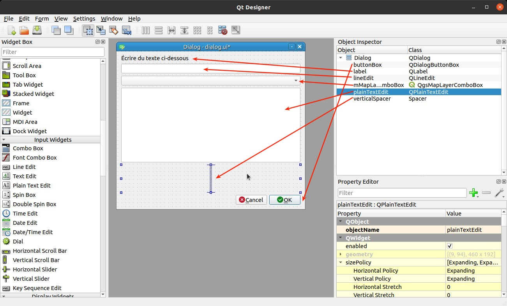

---
Title: Extension Graphique
Favicon: logo.png
Index: True
...

[TOC]

# Créer une extension QGIS avec une interface graphique

Pour faire ce chapitre, il faut d'abord avoir une extension de base, à l'aide du chapitre précédent.

## QtDesigner

Créons un fichier QtDesigner comme-ceci : 


et y ajouter des "widgets" : 



## La classe qui accompagne

Créons un fichier `dialog.py` avec le contenu suivant :

```python

from qgis.core import Qgis
from qgis.utils import iface
from qgis.PyQt.QtWidgets import QDialog, QDialogButtonBox
from qgis.PyQt import uic
from pathlib import Path

folder = Path(__file__).resolve().parent
ui_file = folder.joinpath('dialog.ui')
ui_class, _ = uic.loadUiType(ui_file)


class MonDialog(ui_class, QDialog):

    def __init__(self):
        super().__init__()
        self.setupUi(self)  # Fichier de QtDesigner

```

Modifions la méthode la méthode `run` du fichier `__init__.py` en 

```python
    def run(self):
        from .dialog import MonDialog
        dialog = MonDialog()
        dialog.exec_()
```

Relançons l'extension à l'aide du "plugin reloader" et cliquons sur le bouton.

## Les signaux et les slots

Connectons le signal `clicked` du bouton "Annuler" dans le constructeur `__init__` : 

```python
self.buttonBox.button(QDialogButtonBox.Cancel).clicked.connect(self.close)
```

On dit que `clicked` est un **signal**, auquel on connecte le **slot** `close`. 

Connectons-le **signal** `clicked` du bouton "Accepter" à notre propre **slot** (qui est une fonction) :

```python
self.buttonBox.button(QDialogButtonBox.Ok).clicked.connect(self.click_ok)
```

et ajoutons notre propre fonction `click_ok` pour quitter la fenêtre et en affichant la saisie de
l'utilisateur dans la QgsMessageBar de QGIS.

Le widget de saisie est un QLineEdit : https://doc.qt.io/qt-5/qlineedit.html

```python
def click_ok(self):
    message = self.lineEdit.text()
    iface.messageBar().pushMessage('Notre plugin', message, Qgis.Success)
```

Faire le test dans QGIS avec une saisie de l'utilisateur et fermer la fenêtre.

Continuons en rendant en lecture seule le gros bloc de texte et affichons à l'intérieur la description de la
la couche qui est sélectionnée dans le menu déroulant.

Documentation : 

* QPlainTextEdit : https://doc.qt.io/qt-5/qplaintextedit.html
* QgsMapLayerComboBox : https://qgis.org/api/classQgsMapLayerComboBox.html

Dans le `__init__` : 
```python
self.plainTextEdit.setReadOnly(True)
self.mMapLayerComboBox.layerChanged.connect(self.layer_changed)
```

Et la nouvelle fonction qui va se charger de mettre à jour le texte :

```python

def layer_changed(self):
    self.plainTextEdit.clear()
    layer = self.mMapLayerComboBox.currentLayer()
    if layer:
        self.plainTextEdit.appendPlainText(f"{layer.name()} : {layer.crs().authid()}")
    else:
        self.plainTextEdit.appendPlainText("Pas de couche")

```

On peut donc désormais cumuler l'ensemble des chapitres précédents pour lancer des algorithmes, manipuler les
données etc.

## Solution

```python

from qgis.core import Qgis
from qgis.utils import iface
from qgis.PyQt.QtWidgets import QDialog, QDialogButtonBox
from qgis.PyQt import uic
from pathlib import Path

folder = Path(__file__).resolve().parent
ui_file = folder.joinpath('dialog.ui')
ui_class, _ = uic.loadUiType(ui_file)


class MonDialog(ui_class, QDialog):

    def __init__(self, parent=None):
        _ = parent
        super().__init__()
        self.setupUi(self)  # Fichier de QtDesigner

        # Connectons les signaux
        self.buttonBox.button(QDialogButtonBox.Ok).clicked.connect(self.click_ok)
        self.buttonBox.button(QDialogButtonBox.Cancel).clicked.connect(self.close)

        self.plainTextEdit.setReadOnly(True)
        self.mMapLayerComboBox.layerChanged.connect(self.layer_changed)

    def click_ok(self):
        self.close()
        message = self.lineEdit.text()
        iface.messageBar().pushMessage('Notre plugin', message, Qgis.Success)

    def layer_changed(self):
        self.plainTextEdit.clear()
        layer = self.mMapLayerComboBox.currentLayer()
        if layer:
            self.plainTextEdit.appendPlainText(f"{layer.name()} : {layer.crs().authid()}")
        else:
            self.plainTextEdit.appendPlainText("Pas de couche")

```
