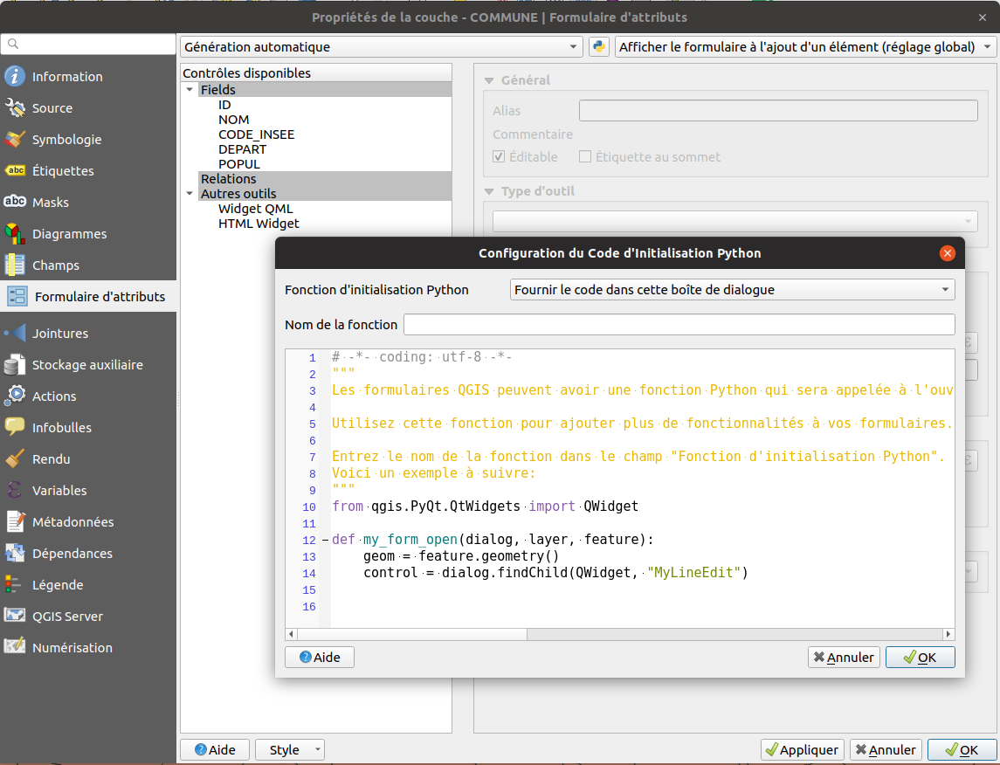

# Le python dans QGIS

QGIS permet d'utiliser du Python dans divers emplacement que nous allons voir ci-dessous.
Python possède de très nombreux packages/modules disponibles sur internet qui fournissent des fonctions déjà
écrites.

## Console

La console est accessible par le menu `Extension` -> `Console Python`. Elle permet l'écriture de commande
simple, une par une. 
On ne peut pas enregistrer les commandes dans un fichier.

## Script Python

L'éditeur de script Python est accessible depuis l'icône dédiée dans la console Python.
Il permet un prototypage rapide d'un script. On peut y écrire du code plus complexe en faisant intervenir
des librairies ou des classes.


## Script Processing

Le menu Traitement dans QGIS donne accès a plusieurs algorithmes d'analyse. 
Ces algorithms proviennent soient de QGIS, GDAL ou encore de plugins.
La boîte à outils de traitements ainsi que le modeleur graphique utilisent le "framework" Processing propre à 
QGIS. Ce framework permet de définir les entrées et les sorties d'un algorithme. Les algorithms sont donc 
normalisés en suivant tous le même modèle. Processing impose la façon d'écrire les scripts.

Écrire un script *compatible* QGIS Processing permet l'intégration dans ce menu, permet également 
l'utilisation de ce-dernier dans un modèle ou encore l'utilisation en mode traitement par lot. Le framework
peut aussi générer automatiquement l'interface graphique de l'algorithme et le code est optimisé.

Il existe un modèle par défaut que l'on peut utiliser pour démarrer l'écriture d'un script Processing.
Depuis la barre d'outils traitements, `Créer un nouveau script depuis un modèle.` Ce modèle utilise la syntaxe
Programmation Orientée Objet. Depuis QGIS 3.6, on peut également utiliser la syntaxe par décorateur `@alg`.
Voir la documentation https://docs.qgis.org/testing/en/docs/user_manual/processing/scripts.html#the-alg-decorator


## Un modèle Processing en Python

Depuis QGIS 3.6, on peut désormais exporter un modèle de traitement Processing en Python.
Il faut faire un clic droit sur un modèle dans la boîte à outils puis choisir "Exporter le modèle comme un 
algorithme Python".
On peut donc modifier ensuite ce fichier Python afin de rajouter de la logique supplémentaire.


## Extension (plugin)

* Extension côté bureautique et même côté QGIS Serveur.
* La plupart des plugins sont disponibles sur [https://plugins.qgis.org](https://plugins.qgis.org) pour le 
  téléchargement, 
ou sinon ils peuvent être installés par un dossier ZIP.
* Afin de développer une extension :
    * Utilisation du Plugin Builder
    * ou squelette minimum : https://github.com/wonder-sk/qgis-minimal-plugin
* Plugin Reloader permet de simplifier le développement en évitant de recharger QGIS
* Documentation plugin QGIS Serveur : https://docs.qgis.org/testing/en/docs/pyqgis_developer_cookbook/server.html

## Fournisseur Processing dans une extension (Processing Provider)

Similaire au script Processing, une extension QGIS peut aussi avoir son propre fournisseur d'algorithme.


On peut remarquer les plugins `DataPlotly`, `QuickOSM` etc.

Ajout de Processing à un plugin QGIS :
* soit lors du plugin builder
* ou manuellement en suivant la documentation pour l'ajout à un plugin existant :
  https://docs.qgis.org/testing/en/docs/pyqgis_developer_cookbook/processing.html 

Il se peut que certaines extensions ne soient *que* des fournisseurs Processing.

## Expressions

Les expressions sont souvent présentes dans QGIS. On peut les utiliser dans nombreux endroits, pour faire des
sélections, des conditions, etc.
On peut également les utiliser à chaque fois que vous pouvez voir ce symbole :


Un plugin, ou même simplement un utilisateur, peut enregistrer ses propres expressions. Ci-dessous, le plugin
`InaSAFE`:


<!--  -->

Exemple de code d'une expression :
```python
@qgsfunction(args='auto', group='Custom')
def my_sum(value1, value2, feature, parent):
    """
    Calculates the sum of the two parameters value1 and value2.
    <h2>Example usage:</h2>
    <ul>
      <li>my_sum(5, 8) -> 13</li>
      <li>my_sum("field1", "field2") -> 42</li>
    </ul>
    """
    return value1 + value2
```

## Macros

!!! warning
    Pensez à autoriser les macros dans les 
    Propriétés de QGIS ➡ Général ➡ Fichiers du projet ➡ Activer les macros

Accessible depuis les propriétés du projet, dans l'onglet `Macros`. On peut lancer du code Python 
automatiquement soit :
* à l'ouverture du projet
* lors de l'enregistrement du projet
* ou lors de sa fermeture 


## Formulaire

!!! warning
    Pensez à autoriser les macros dans les 
    Propriétés de QGIS ➡ Général ➡ Fichiers du projet ➡ Activer les macros

On peut personnaliser un formulaire par l'ajout de logique Python. Cependant, dans QGIS 3, 
l'utilisation de Python n'est plus forcément nécessaire, on peut désormais utiliser des expressions 
**(recommandé)**.



## Actions

Les actions sont des petits traitements que l'on peut lancer soit depuis la table attributaire ou depuis le
canevas.
Par exemple, on peut ouvrir un lien WEB ou un PDF en fonction d'un attribut d'une entité. Il est possible 
d'écrire les actions en Python.


## Application/script indépendant

Sans lancer QGIS graphiquement, on peut utiliser la librairie QGIS dans nos scripts Python. On peut donc créer
notre propre application graphique ou notre propre exécutable et ainsi utiliser les fonctions de QGIS.
On peut donc faire un programme en ligne de commande qui effectue une certaine opération dans un répertoire
donné.

**Depuis QGIS 3.16**, nous pouvons lancer un modèle ou un script Processing depuis la ligne de commande depuis
l'outil [qgis_process](https://docs.qgis.org/testing/en/docs/user_manual/processing/standalone.html).

## Le fichier "startup.py"

Si l'on place un fichier nommé `startup.py` dans le dossier Python du profil de l'utilisateur, QGIS va le
lancer automatiquement à chaque ouverture de QGIS.
