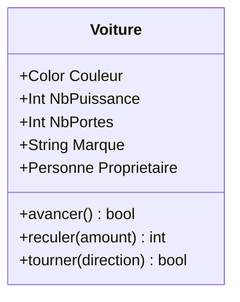
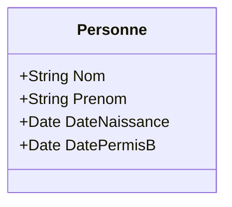
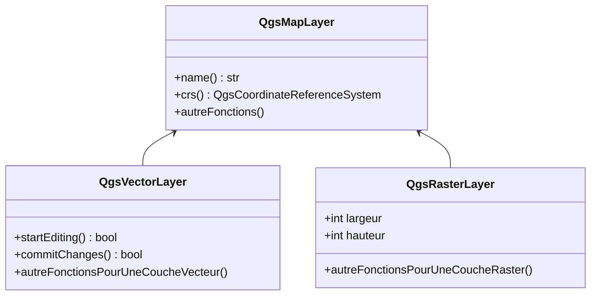

# Introduction à la console Python

## Données

Nous allons utiliser un département de la [BDTopo](https://geoservices.ign.fr/bdtopo).

!!! tip
    Les DROM-COM ou le Territoire de Belfort (90) sont assez légers.

## Configurer le projet

* Commencer un nouveau projet et enregistrer le.
* À côté du projet, ajouter le dossier provenant de la BDTopo, par exemple `BDT_3-3_SHP_LAMB93_D0ZZ-EDYYYY-MM-DD`.

## Manipulation dans la console

### Rappel sur la POO

La Programmation Orientée Objet, **POO** :

* la POO permet de mieux modéliser la réalité en concevant des modèles d'objets, les classes
* les objets sont créés indépendamment les uns des autres, grâce à l'encapsulation, mécanisme qui permet d'embarquer leurs propriétés
* les classes permettent d'éviter au maximum l'emploi des variables globales

Imaginons le cas d'une voiture.

Une voiture est un objet, on peut en créer une instance.
Sur cette instance, on a des "propriétés" comme :

* la couleur de la voiture
* le nombre de chevaux
* le nombre de portes
* la marque
* le propriétaire (qui peut être un autre objet "Personne")

Sur cette instance, on a des "méthodes" :

* avancer
* reculer
* tourner à gauche
* verrouiller les portes
* activer les clignotants



On peut continuer en écrivant une classe qui va contenir une **Personne** :



### Pratique

* Dans QGIS, `Plugins` -> `Console Python`
* QGIS nous donne accès au projet actuel via la classe `QgsProject`
	* [https://qgis.org/api/classQgsProject.html](https://qgis.org/api/classQgsProject.html)
	* [https://qgis.org/pyqgis/3.34/core/QgsProject.html](https://qgis.org/pyqgis/3.34/core/QgsProject.html)

* Dans la documentation (en C++ surtout), on remarque plusieurs sections :
	* Public types
	* Public slots
	* Signals
	* Public Member Functions
	* Static Public Member Functions
* Nous verrons progressivement ces différentes sections.
* En haut de la documentation, il y a une explication sur le cas particulier de `QgsProject.instance()`.
* Recherchons `filename`.
```python
project = QgsProject.instance()
project.fileName()
```
* Ajoutons un titre à notre projet. Dans l'interface graphique, cela se passe dans les propriétés de notre projet.
  Il y a donc des chances que cela soit aussi dans la classe **QgsProject**
* Recherchons donc `title` dans la page : `setTitle` dans la classe
  [QgsProject](https://qgis.org/api/classQgsProject.html).

!!! warning
    Il est important de bien pouvoir lire la signature des **méthodes**.
    La méthode `title` retourne une **QString** et **ne prend pas** de paramètre.
    La méthode `setTitle` retourne **rien**, (**void**) mais elle prend un paramètre, une **QString**.

* Nous souhaitons désormais changer la couleur de fond du projet.
    * Recherchons `background`
    * Nous allons devoir utiliser aussi la classe [QColor](https://doc.qt.io/qt-5/qcolor.html)

??? "Afficher la solution"
    ```python
    color = QColor("#00A2FF")
    QgsProject.instance().setBackgroundColor(color)
    ```

* Objectif, ajouter une couche vecteur contenu dans un dossier fils :
    * Recherchons dans l'API le dossier racine du projet. *Indice*, en informatique, on appelle souvent cela le `home`.
    * Nous allons utiliser le module `os.path` pour manipuler les dossiers.
    * [https://docs.python.org/3/library/os.path.html](https://docs.python.org/3/library/os.path.html)
    * `join`, `isfile`, `isdir`

```python
from os.path import join, isfile, isdir
racine = QgsProject.instance().homePath()
join(racine, 'nexiste_pas')
'/home/etienne/Documents/3liz/formation/nexiste_pas'
isfile(join(racine,'nexiste_pas'))
False
isdir(join(racine,'nexiste_pas'))
False
chemin = join(racine, 'BDT_3-3_SHP_LAMB93_D0ZZ-EDYYYY-MM-DD', 'ADMINISTRATIF')
fichier_shape = join(chemin, 'COMMUNE.shp')
isfile(fichier_shape)
True
```

* Charger la couche vecteur à l'aide de `iface` [QgisInterface](https://qgis.org/api/classQgisInterface.html)
  (et non pas **Qgs**Interface !)

```python
communes = iface.addVectorLayer(fichier_shape, 'communes', 'ogr')
print(communes)
```

* Charger la couche autrement (conseillé)
```python
communes = QgsVectorLayer(fichier_shape, 'communes', 'ogr')
communes.isValid()
QgsProject.instance().addMapLayer(communes)
```

??? "Afficher la solution complète avec `pathlib`"
    ```python
    from pathlib import Path
    project = QgsProject.instance()
    racine = Path(project.homePath())
    chemin = racine.joinpath('BDT_3-3_SHP_LAMB93_D0ZZ-EDYYYY-MM-DD', 'ADMINISTRATIF')
    fichier_shape = chemin.joinpath('COMMUNE.shp')
    # fichier_shape.is_file()
    communes = QgsVectorLayer(str(fichier_shape), 'communes', 'ogr')
    # communes.isValid()
    QgsProject.instance().addMapLayer(communes)
    ```

??? "Afficher la solution complète avec `os.path`"
	```python
	from os.path import join, isfile, isdir

	project = QgsProject.instance()

	racine = project.homePath()
	chemin = join(racine, 'BDT_3-3_SHP_LAMB93_D0ZZ-EDYYYY-MM-DD', 'ADMINISTRATIF')
	fichier_shape = join(chemin, 'COMMUNE.shp')
	communes = QgsVectorLayer(fichier_shape, 'communes', 'ogr')
	communes.isValid()
	QgsProject.instance().addMapLayer(communes)
	```

* Explorer l'objet `communes` qui est un `QgsVectorLayer` à l'aide de la documentation pour chercher sa
  géométrie, le nombre d'entités.
  [API QgsVectorLayer C++](https://qgis.org/api/classQgsVectorLayer.html), [API QgsVectorLayer Python](https://qgis.org/pyqgis/3.34/core/QgsVectorLayer.html)
* Pour la géométrie, toujours utiliser l'énumération et non pas le chiffre

```python
communes.geometryType() == QgsWkbTypes.PolygonGeometry
communes.geometryType() == QgsWkbTypes.PointGeometry
```

* Essayer d'ouvrir et de clore une session d'édition
* Essayer désormais de chercher son nom, la projection ou encore les seuils de visibilité de la couche.
On ne les trouve pas dans la page `QgsVectorLayer` !
Pour cela, il faut faire référence à la notion d'héritage en Programmation Orientée Objet.



L'objet `QgsVectorLayer` hérite de `QgsMapLayer` qui est une classe commune avec `QgsMapLayer`.

[API QgsMapLayer C++](https://qgis.org/api/classQgsMapLayer.html), [API QgsMapLayer Python](https://qgis.org/pyqgis/3.34/core/QgsMapLayer.html)

Regardons la fonction `isinstance` qui permet de tester si un objet est une instance d'une classe :

```python
isinstance(communes, QgsVectorLayer)
True
isinstance(communes, QgsRasterLayer)
False
isinstance(communes, QgsMapLayer)
True
```

* Objectif, ne pas afficher la couche commune pour une échelle plus petite que le `1:2 000 000`.

## Code

Petit récapitulatif à tester pour voir si cela fonctionne correctement !

```python
from os.path import join
dossier = 'BDT_3-3_SHP_LAMB93_D0ZZ-EDYYYY-MM-DD'
thematique = 'ADMINISTRATIF'
couche = 'COMMUNE'

racine = QgsProject.instance().homePath()
fichier_shape = join(racine, dossier, thematique, '{}.shp'.format(couche))
layer = QgsVectorLayer(fichier_shape, couche, 'ogr')
result = QgsProject.instance().addMapLayer(layer)

print(layer.featureCount())
print(layer.crs().authid())
print('Est en mètre : {}'.format(layer.crs().mapUnits() ==  QgsUnitTypes.DistanceMeters))
print(layer.name())
layer.setScaleBasedVisibility(True)
layer.setMaximumScale(1)
layer.setMinimumScale(2000000)
layer.triggerRepaint()
```

* Ajouter également la couche `ARRONDISSEMENT` et sélectionner là.

## Parcourir les entités

Un raccourci a savoir, dans la console :
```python
iface.activeLayer()
```
Cela retourne la couche `QgsMapLayer` active dans la légende !

On souhaite désormais itérer sur les polygones et les faire clignoter depuis la console.
Nous allons donc avoir besoin de la méthode `getFeatures()` qui fait partie de `QgsVectorLayer`.

```python
layer = iface.activeLayer()
features = layer.getFeatures()
features
feature = QgsFeature()
features.nextFeature(feature)
iface.mapCanvas().flashFeatureIds(layer, [feature.id()])
```

*Note*, nous pouvons concaténer les deux dernières lignes à l'aide du caractère `;` pour que cela soit plus
pratique.

Ce code est plus pour la partie "amusante" pour montrer les limites de la console. Nous allons désormais
utiliser un script Python dans le prochain chapitre.

Petite chose supplémentaire avant de passer aux scripts, on souhaite désormais afficher le nom des
arrondissements à l'aide d'une boucle `for`.

```python
layer = iface.activeLayer()
for feature in layer.getFeatures():
	# On peut traiter l'entité courante grâce à la variable "feature".
	# Pour accéder à un attribut en particulier, on peut y accéder avec des crochets.
	pass
```

Noter l'apparition de `...` au lieu de `>>>` après avoir écrit la première ligne du `for`.
Il faut faire une indentation obligatoire !

Pour afficher un attribut, on peut faire `print(feature['NOM_ARR'])` pour afficher le contenu de l'attribut
`NOM_ARR`.
