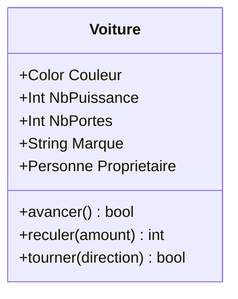
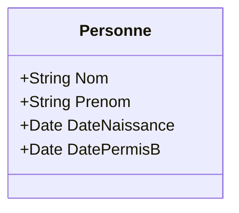
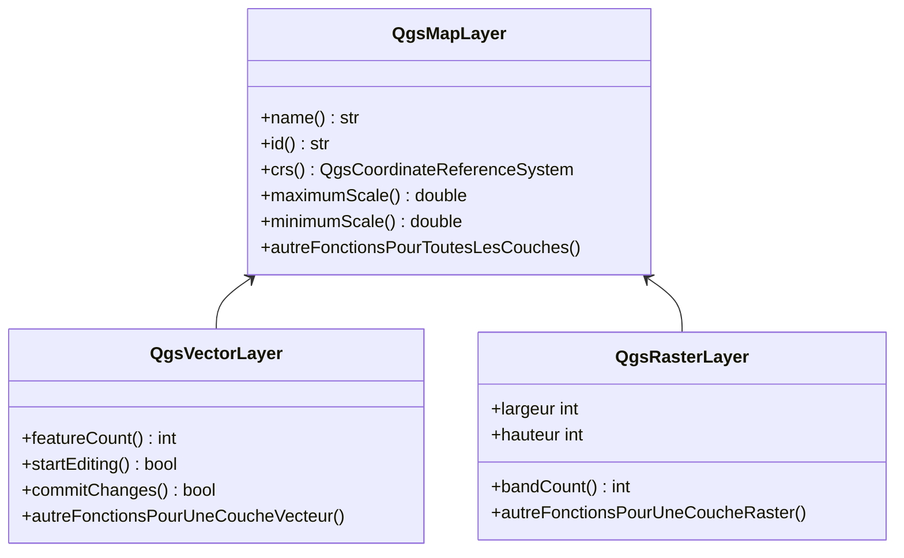

# Introduction à la console Python

## Données

Nous allons utiliser un département de la [BDTopo](https://geoservices.ign.fr/bdtopo).

!!! tip
    Les DROM-COM ou le Territoire de Belfort (90) sont assez légers.

1. Renommer le dossier `BDT_3-3_SHP_LAMB93_D0ZZ-EDYYYY-MM-DD` en `BD_TOPO` afin de simplifier les corrections.

## Configurer le projet

* Commencer un nouveau projet et enregistrer le dans un dossier.
* À côté du projet `qgs` ou `qgz`, ajouter le dossier provenant de la BDTopo, le dossier `BD_TOPO` ci-dessus.

```bash
.
├── BD_TOPO
│   ├── ADMINISTRATIF
│   ├── ADRESSES
│   ├── BATI
│   ├── HYDROGRAPHIE
│   ├── LIEUX_NOMMES
│   ├── OCCUPATION_DU_SOL
│   ├── SERVICES_ET_ACTIVITES
│   ├── TRANSPORT
│   └── ZONES_REGLEMENTEES
└── formation.qgs
```

## Manipulation dans la console

### Rappel sur la POO

La Programmation Orientée Objet, **POO** :

* la POO permet de mieux modéliser la réalité en concevant des modèles d'objets, les classes
* les objets sont créés indépendamment les uns des autres, grâce à l'encapsulation, mécanisme qui permet d'embarquer leurs propriétés
* les classes permettent d'éviter au maximum l'emploi des variables globales

Imaginons le cas d'une voiture.

Une voiture est un objet, on peut en créer une instance.
Sur cette instance, on a des "propriétés" comme :

* la couleur de la voiture
* le nombre de chevaux
* le nombre de portes
* la marque
* le propriétaire (qui peut être un autre objet "Personne")

Sur cette instance, on a des "méthodes" :

* avancer
* reculer
* tourner à gauche
* verrouiller les portes
* activer les clignotants



On peut continuer en écrivant une classe qui va contenir une **Personne** :



## Pratique

### Documentation

* Dans QGIS, `Plugins` -> `Console Python`
* QGIS nous donne accès au projet actuel via la classe `QgsProject`
	* [https://qgis.org/api/classQgsProject.html](https://qgis.org/api/classQgsProject.html)
	* [https://qgis.org/pyqgis/3.34/core/QgsProject.html](https://qgis.org/pyqgis/3.34/core/QgsProject.html)

* Dans la documentation (en C++ surtout), on remarque plusieurs sections :
	* Public types
	* Public slots
	* Signals
	* Public Member Functions
	* Static Public Member Functions
* Nous verrons progressivement ces différentes sections.
* En haut de la documentation, il y a une explication sur le cas particulier de `QgsProject.instance()`.
* Afin de trouver le chemin de notre projet, recherchons `filepath`, afin de trouver une méthode `absoluteFilePath`:
```python
project = QgsProject.instance()
project.absoluteFilePath()
```
* Ajoutons un titre à notre projet. Dans l'interface graphique, cela se passe dans les propriétés de notre projet.
  Il y a donc des chances que cela soit aussi dans la classe **QgsProject**
* Recherchons donc `title` dans la page : `setTitle` dans la classe
  [QgsProject](hhttps://qgis.org/pyqgis/3.34/core/QgsProject.html).

!!! warning
    Il est important de bien pouvoir lire la signature des **méthodes** :

    * La méthode `title` retourne une **QString** (`str` en Python) et **ne prend pas** de paramètre.
    * La méthode `setTitle` retourne **rien**, (`void`, en CPP et `None` en Python) mais elle prend un paramètre, une **str**.

* Nous souhaitons désormais changer la couleur de fond du projet.
    * Recherchons `background`
    * Nous allons devoir utiliser aussi la classe [QColor CPP](https://doc.qt.io/qt-5/qcolor.html), [QColor PySide2](https://doc.qt.io/qtforpython-5/PySide2/QtGui/QColor.html).

??? "Afficher la solution"
    ```python
    color = QColor("#00A2FF")
    QgsProject.instance().setBackgroundColor(color)
    ```

### Manipulation en console pour ajouter une couche Shapefile

* Objectif, ajouter une couche vecteur contenu dans un dossier fils :
    * Exemple `BD_TOPO/ADMINISTRATIF/COMMUNE.shp` :
    * Recherchons dans l'API de `QgsProject` le fichier actuel du projet, à l'aide `filepath`.
    * L'utilisation de `home` est un peu différente, dans QGIS on peut définir un répertoire différent pour la racine des données.
    * Nous allons utiliser l'objet `Path` pour manipuler les fichiers/dossiers.
    * [Objet Path](https://docs.python.org/3/library/pathlib.html)

!!! note
    L'utilisation de l'objet `Path` est très habituelle, mais on rencontre aussi l'utilisation des fonctions du module
    `os.path` comme `os.path.join`... On rencontre son utilisation dans plusieurs tutoriels/solutions/forums.

#### Solution étape par étape

Pour récupérer le projet en cours
```python
project = QgsProject.instance()
```

Pour passer du chemin `str` de QGIS à un objet `Path` et directement appeler la propriété `parent` pour obtenir le dossier :
```python
racine = Path(project.absoluteFilePath()).parent
```

On peut joindre notre BDTopo, en donnant plusieurs paramètres à `joinpath` :
```python
chemin = racine.joinpath('BD_TOPO', 'ADMINISTRATIF')
fichier_shape = chemin.joinpath('COMMUNE.shp')
```

Il ne faut pas hésiter à vérifier au fur et à mesure avec des `print` :

```python
print(racine)
print(racine.is_dir())
print(racine.is_file())
print(fichier_shape.exists())
print(fichier_shape.is_file())
```

!!! tip
    Tant que l'on est en console, on n'a pas besoin de faire `print`, la console le fait pour nous automatiquement.
    On peut se contenter de `fichier_shape.exists()`.

Si tout est bon pour le chemin, charger la couche vecteur à l'aide de `iface` qui est une instance de
`QgisInterface` [CPP](https://qgis.org/api/classQgisInterface.html)/[PyQGIS](https://qgis.org/pyqgis/3.34/gui/QgisInterface.html)
(et non pas **Qgs**Interface), en utilisant la méthode `addVectorLayer`.

Attention, QGIS, étant écrit en C++, ne connait pas l'usage de `Path`, il faut repasser par une chaîne de caractère avec l'aide de `str` :

```python
communes = iface.addVectorLayer(str(fichier_shape), 'communes', 'ogr')
print(communes)
```

!!! tip "Charger la couche autrement à l'aide du constructeur `QgsVectorLayer` (conseillé)"
    ```python
    communes = QgsVectorLayer(str(fichier_shape), 'communes', 'ogr')
    # communes.isValid()
    QgsProject.instance().addMapLayer(communes)
    ```

??? "Afficher la solution complète avec `pathlib`"
    ```python
    from pathlib import Path
    project = QgsProject.instance()
    racine = Path(project.absoluteFilePath()).parent
    chemin = racine.joinpath('BD_TOPO', 'ADMINISTRATIF')
    fichier_shape = chemin.joinpath('COMMUNE.shp')
    # fichier_shape.is_file()
    communes = QgsVectorLayer(str(fichier_shape), 'communes', 'ogr')
    # communes.isValid()
    QgsProject.instance().addMapLayer(communes)
    ```

??? "Afficher "l'ancienne" solution complète avec `os.path`"
	```python
	from os.path import join, isfile, isdir

	project = QgsProject.instance()

	racine = project.homePath()
	chemin = join(racine, 'BD_TOPO', 'ADMINISTRATIF')
	fichier_shape = join(chemin, 'COMMUNE.shp')
	communes = QgsVectorLayer(fichier_shape, 'communes', 'ogr')
	communes.isValid()
	QgsProject.instance().addMapLayer(communes)
	```

!!! success
    Bien joué si vous avez votre couche des communes !

### Découverte des méthodes sur notre objet `communes`

Notre **variable** `communes` est une instance de `QgsVectorLayer`.

[API QgsVectorLayer C++](https://qgis.org/api/classQgsVectorLayer.html), [API QgsVectorLayer Python](https://qgis.org/pyqgis/3.34/core/QgsVectorLayer.html)

À l'aide de la documentation, recherchons :

* le nombre d'entités, (indice : `count`, `feature`, `featureCount`)
* comment ouvrir et fermer une session d'édition (indice : `editing`, `start` et ne pas hésiter à lire la docstring)
* le type de géométrie, mot clé `geometry`, `type`, `geometryType`

!!! info
    L'API est en train de changer depuis QGIS 3.30 environ, concernant l'usage et l'affichage des énumérations.
    Par exemple pour `geometryType`.

    ```python
    communes.geometryType() == QgsWkbTypes.PolygonGeometry
    communes.geometryType() == QgsWkbTypes.PointGeometry
    ```

    Pour la géométrie, toujours utiliser l'énumération et non pas le chiffre, ce n'est pas compréhensible (QGIS < 3.30)

* Essayons désormais de chercher :
    * son nom : `name`
    * les seuils de visibilité de la couche min et max (`scale`, `minimum`, `maximum`)

On ne les trouve pas dans la page `QgsVectorLayer` !
Pour cela, il faut faire référence à la notion d'héritage en Programmation Orientée Objet.

### Héritage

Il faut bien regarder les diagrammes en haut de la documentation :

[API QgsVectorLayer C++](https://qgis.org/api/classQgsVectorLayer.html), [API QgsVectorLayer Python](https://qgis.org/pyqgis/3.34/core/QgsVectorLayer.html)



L'objet `QgsVectorLayer` hérite de `QgsMapLayer` qui est une classe commune avec `QgsRasterLayer`.

[API QgsMapLayer C++](https://qgis.org/api/classQgsMapLayer.html), [API QgsMapLayer Python](https://qgis.org/pyqgis/3.34/core/QgsMapLayer.html)

!!! tip
    On peut désormais regarder la documentation CPP de QGIS et Qt pour voir l'ensemble des membres,
    **y compris les membres hérités**.
    [QgsVectorLayer CPP](https://api.qgis.org/api/classQgsVectorLayer.html) ou [QComboBox](https://doc.qt.io/qt-6/qcombobox.html)

Regardons la fonction `isinstance` qui permet de tester si un objet est une instance d'une classe :

```python
isinstance(communes, QgsVectorLayer)
True
isinstance(communes, QgsRasterLayer)
False
isinstance(communes, QgsMapLayer)
True
```

* Objectif, ne pas afficher la couche commune pour une échelle plus petite que le `1:2 000 000`.

```python
communes.setMinimumScale(2000000)
communes.setMaximumScale(500000)
communes.setScaleBasedVisibility(True)
# communes.triggerRepaint()
```

!!! important
    Un raccourci à savoir, dans la console :
    ```python
    iface.activeLayer()
    ```

    Cela retourne la couche `QgsMapLayer` active dans la légende !

## Code

Petit récapitulatif à tester pour voir si cela fonctionne correctement !

```python
from pathlib import Path
dossier = 'BD_TOPO'
thematique = 'ADMINISTRATIF'
couche = 'COMMUNE'

project = QgsProject.instance()
racine = Path(project.absoluteFilePath()).parent
chemin = racine.joinpath(dossier, thematique)
fichier_shape = chemin.joinpath(f'{couche}.shp')

print(layer.featureCount())
print(layer.crs().authid())
print('Est en mètre : {}'.format(layer.crs().mapUnits() ==  QgsUnitTypes.DistanceMeters))
print(layer.name())
layer.setScaleBasedVisibility(True)
layer.setMaximumScale(500000)
layer.setMinimumScale(2000000)
layer.triggerRepaint()
```

## Transition vers le script, avec le parcourir des entités

Ajouter également la couche `ARRONDISSEMENT` et sélectionner là.

On souhaite désormais itérer sur les polygones et les faire clignoter depuis la console.
Nous allons donc avoir besoin de la méthode `getFeatures()` qui fait partie de `QgsVectorLayer`.

```python
layer = iface.activeLayer()
features = layer.getFeatures()
features
feature = QgsFeature()
features.nextFeature(feature)
iface.mapCanvas().flashFeatureIds(layer, [feature.id()])
```

*Note*, nous pouvons concaténer les deux dernières lignes à l'aide du caractère `;` pour que cela soit plus
pratique.

Ce code est plus pour la partie "amusante" pour montrer les limites de la console. Nous allons désormais
utiliser un script Python dans le prochain chapitre.

Petite chose supplémentaire avant de passer aux scripts, on souhaite désormais afficher le nom des
arrondissements à l'aide d'une boucle `for`.

```python
layer = iface.activeLayer()
for feature in layer.getFeatures():
	# On peut traiter l'entité courante grâce à la variable "feature".
	# Pour accéder à un attribut en particulier, on peut y accéder avec des crochets.
	pass
```

Noter l'apparition de `...` au lieu de `>>>` après avoir écrit la première ligne du `for`.
Il faut faire une indentation obligatoire !

Pour afficher un attribut, on peut faire `print(feature['NOM_ARR'])` pour afficher le contenu de l'attribut
`NOM_ARR`.
