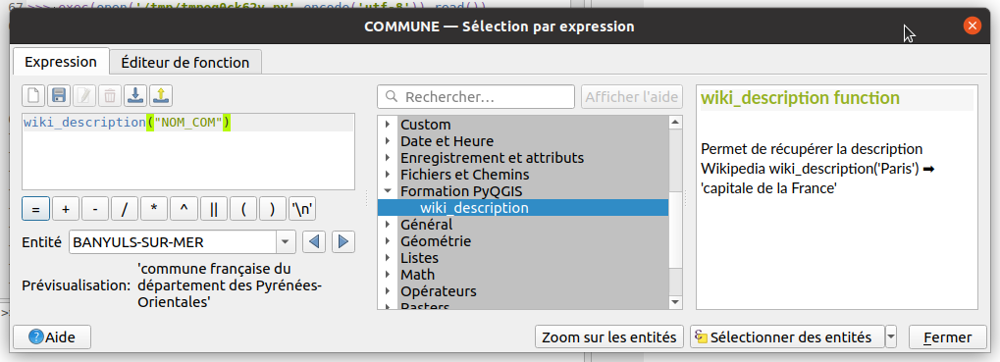

# Expression

On peut définir sa propre expression QGIS à l'aide de Python.
Il existe un chapitre dans le 
[Python cookbook](https://docs.qgis.org/latest/fr/docs/user_manual/expressions/expression.html?#function-editor)

Dans la fenêtre des expressions QGIS, on peut observer la fonction déjà existante.

`feature`, `parent` et `context` sont des paramètres particuliers dans la **signature** de la fonction. Si QGIS trouve
le mot-clé, il assigne l'objet correspondant :

* `feature` : [QgsFeature](https://api.qgis.org/api/classQgsFeature.html) pour l'entité en cours
* `parent` : [QgsExpression](https://api.qgis.org/api/classQgsExpression.html) l'expression QGIS en cours
* `context` : [QgsExpressionContext](https://api.qgis.org/api/classQgsExpressionContext.html) pour le contexte d'exécution
  de l'expression

## Exemple

On souhaite utiliser l'API de Wikipédia afin de récupérer la **description** d'un terme.



Par exemple, si on cherche le terme `Montpellier` avec l'API Wikipédia :

https://fr.wikipedia.org/w/api.php?action=query&titles=Montpellier&prop=description&format=json

Il existe plusieurs moyens de faire des requêtes HTTP en Python et/ou PyQGIS. Utilisons la technique Processing
avec l'algorithme "Téléchargeur de fichier" (graphiquement, il n'est disponible que dans le modeleur) :

```python
search = "montpellier"
results = processing.run(
    "native:filedownloader",
    {
        "URL": f"https://fr.wikipedia.org/w/api.php?action=query&titles={search}&prop=description&format=json",
        "OUTPUT": "TEMPORARY_OUTPUT"
    }
)
```

!!! tip
    On peut afficher le panneau de débogage et développement de QGIS afin de voir les requêtes HTTP.
    Il se trouve dans le menu **Vue** ▶ **Panneau**  ▶ **Débogage et développement**

On va désormais **parser** le fichier JSON que l'on obtient avec la libraire `json` afin de récupérer la `description`.

## Mémo

Pour lire un fichier à l'aide d'un "contexte Python" qui va ouvrir et ferme le fichier :

```python
import json

with open("/mon/fichier.json") as f:
    data = json.load(f)
print(data)
```

Une méthode pour récupérer la bonne clé, dynamiquement :

```python
pages = data['query']['pages']
key = list(pages.keys())[0]
description = pages[key]['description']
print(description)
```

Peut-être surement plus simple à comprendre, avec l'usage d'une boucle `for`

```python
description = ""
for page in pages.values():
    description = page.get('description')

print(description)
```

??? "Une solution complète pour l'expression QGIS"
    ```python
    import json
    import processing
    
    @qgsfunction(args='auto', group='Formation PyQGIS')
    def wiki_description(search, feature, parent):
        """Permet de récupérer la description Wikipedia
        
        wiki_description('Paris') ➡ 'capitale de la France'
        """
        results = processing.run(
            "native:filedownloader",
            {
                "URL": f"https://fr.wikipedia.org/w/api.php?action=query&titles={search}&prop=description&format=json",
                "OUTPUT": "TEMPORARY_OUTPUT"
            }
        )
    
        with open(results['OUTPUT']) as f:
            data = json.load(f)
    
        pages = data['query']['pages']
        # Only the first page will be used
        for page_id, page in pages.items():
            description = page.get('description')
            if page_id == "-1":
                error = page.get('invalidReason')
                if description:
                    return f'Pas de page, {description}'
                if not error:
                    return 'Pas de page'
                else:
                    return f"Pas de page, erreur {error}"
            return description
    ```

## Fournir une expression depuis une extension

Pour le moment, cette expression est dans le dossier de l'utilisateur, dans `python → expressions`.

Mais une fois que nous avons une [extension générique](./extension-generique.md), nous pouvons l'intégrer dans un
fichier Python de l'extension.

Exemple sur [StackExchange](https://gis.stackexchange.com/questions/355319/register-custom-python-function-in-qgis-server-3-10)
