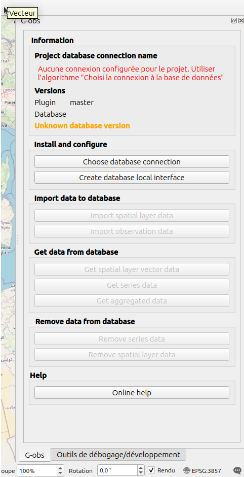

# La base pour créer une extension

## Une extension n'est qu'un ZIP pour fournir du code Python

Comme vu dans [Le Python dans QGIS](./python-qgis.md), une extension peut être sous différente forme :

* fournir une interface graphique (voir ci-dessous)
* être un fournisseur d'algorithme Processing (voir ci-dessous)
* fournir une expression, comme dans le [TP Wikipédia](./expression.md)
* fournir un outil de recherche dans le "locator" (taper pour trouver)
* ...

## Modèle de base

Pour créer une extension dans QGIS, il existe deux façons de démarrer : 

* Utilisation de l'extension "Plugin Builder" :
    * Disponible depuis le gestionnaire des extensions de QGIS
    * Assistant de création
    * Très (trop) complet, il y a squelette pour :
        * Du code avec des actions, ...
        * Générer de la documentation Sphinx
        * Des tests unitaires
        * Les traductions (multilingue)
    * Très historique, moins mis à jour ces dernières années, [dernière version de 2019](https://plugins.qgis.org/plugins/pluginbuilder3/#plugin-versions)
    * https://github.com/g-sherman/Qgis-Plugin-Builder/
* QGIS Minimal plugin :
    * Idée originale https://github.com/wonder-sk/qgis-minimal-plugin
    * "Fork" pour la formation https://github.com/Gustry/qgis_minimal_plugin
    * ZIP à télécharger et à extraire
    * Très léger
    * Besoin de **tout** refaire depuis zéro

Nous pouvons suivre une des deux méthodes, mais dans le cadre de la formation, faisons la méthode minimale.
Dans les deux cas, le résultat doit être dans le dossier `python/plugins` du profil courant.

!!! tip
    Pour trouver le profil courant, dans QGIS, `Préférences` -> `Profils Utilisateurs` -> `Ouvrir le dossier du profil actif`.

!!! tip
    Pour installer le Minimal Plugin, vous pouvez utiliser le gestionnaire des extensions pour installer
    depuis un zip.

Exemple d'utilisation d'un panneau qui présentent les algorithmes "Processing" :

### Le fichier `metadata.txt`

[Liste des valeurs possibles](https://docs.qgis.org/3.34/en/docs/pyqgis_developer_cookbook/plugins/plugins.html#metadata-txt)
dans un fichier `metadata.txt`

## Extensions utiles

### Plugin reloader

**Indispensable**

Le "Plugin Reloader" est une extension indispensable pour développer une extension pour recharger son 
extension. Elle est disponible dans le gestionnaire des extensions.

### PyQGIS Resource Browser

**Utile pour l'ergonomie**

Permet d'aller chercher des icônes déjà existantes dans la libraire QGIS et Qt

### First aid

**Utile pour aller plus loin**

Extension pour débugger en cas d'une erreur Python

## Apprendre d'une autre extension

Comme les extensions sur qgis.org sont disponibles sur internet, on peut regarder le code source pour
comprendre.

Pensez à ouvrir le dossier de votre profil QGIS en suivant l'astuce ci-dessus puis dans `python/plugins`.
