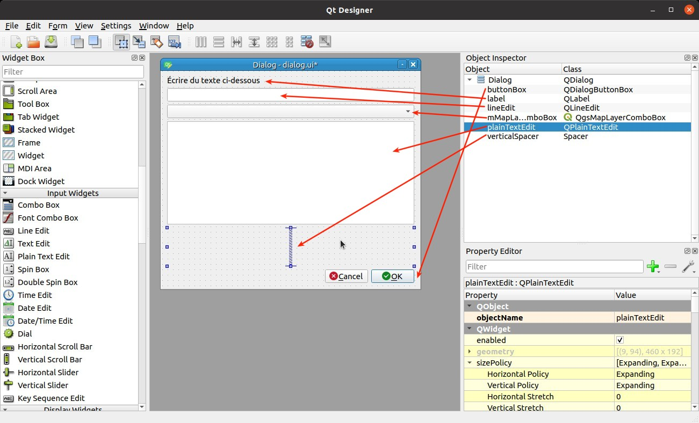

# Créer une extension QGIS avec une interface graphique

Pour faire ce chapitre, il faut d'abord avoir une extension de base, à l'aide du chapitre précédent.

## QtDesigner

### Premier dialogue

Créons un fichier QtDesigner comme-ceci : 


### Découverte de l'interface QtDesigner

* Faire le tour des "widgets", de "l'object inspector" et des "property"
* Privilégier les "widgets QGIS" si possible

!!! tip
    Privilégier aussi les "Item Widgets (Item Based)" plutôt que les "Item Views (Model Based) pour débuter.

### Ajoutons les "widgets"

!!! important
    Ne tenez pas compte de l'alignement des widgets pour le moment. On fait juste un placement "rapide"
    vertical des widgets.

Dans l'ordre vertical, ce sont ces classes :

| Classe                |
|-----------------------|
| `QLabel`              |
| `QLineEdit`           |
| `QgsMapLayerComboBox` |
| `QPlainTextEdit`      |
| Vertical spacer       |
| `QDialogButtonBox`    |



Une fois que l'ensemble des "widgets" sont présents, on peut faire un clic droit à droite sur notre `QDialog`,
puis `Mise en page` et enfin `Verticalement` 🚀

### Ajout d'un bouton dans notre "ButtonBox" en bas

Ajoutons le bouton d'**aide**, dans les propriétés de notre widget `QDialogButtonBox`.

#### Nommage de nos "widgets"

Pour chacun de nos widgets, changeons le nom par défaut de l'objet, propriété `objectName` tout en haut :

| Classe                | Nom par défaut de `objectName` | Nouveau nom pour `objectName` |
|-----------------------|--------------------------------|-------------------------------|
| `QLineEdit`           | `lineEdit`                     | `input_text`                  |
| `QgsMapLayerComboBox` | `mMapLayerComboBox`            | `couche`                      |
| `QPlainTextEdit`      | `plainTextEdit`                | `metadata`                    |
| `QDialogButtonBox`    | `buttonBox`                    | `button_box`                  |

Cette propriété `objectName` est très importante, car elle détermine l'appellation de notre **propriété** dans
l'objet `self` pour la suite du TP.

### Astuces

* Ouvrir la page des "slots/signaux" depuis la barre d'outils et supprimer ceux qui existent.

!!! tip "Pourquoi supprimer les signaux de QtDesigner ?"
    Un fichier **QtDesigner** est "gros" fichier XML. Il est difficile, dans le temps, de suivre ces modifications,
    changement…

    Il est, à mon avis, plus simple de garder le fichier XML le plus léger possible, et de garder la logique dans le code
    Python. Un signal en XML, c'est plusieurs lignes dans le fichier UI, alors que en Python, c'est une seule ligne.

On peut [télécharger](./solution/dialog.ui) la solution si besoin.

* Enregistrer le fichier en `dialog.ui` dans votre dossier contenant l'ensemble des fichiers.

## La classe qui accompagne

Créons un fichier `dialog.py` avec le contenu suivant :

```python
# Les imports
from qgis.core import Qgis
from qgis.utils import iface
from qgis.PyQt.QtWidgets import QDialog, QDialogButtonBox
from qgis.PyQt import uic
from pathlib import Path

# Permettre d'aller chercher le fichier UI correspondant
folder = Path(__file__).resolve().parent
ui_file = folder.joinpath('dialog.ui')
ui_class, _ = uic.loadUiType(ui_file)


class MonDialog(ui_class, QDialog):

    """ Classe qui représente le dialogue de l'extension. """
    
    def __init__(self, parent: QDialog):
        """ Constructeur. """
        super().__init__(parent)  # Appel du constructeur parent
        self.parent = parent  # Stockage du parent dans self, on va l'utiliser plus tard, si besoin
        self.setupUi(self)  # Fichier de QtDesigner

        # Quelques propriétés facultatives
        self.setWindowTitle("Notre super machine à café")
        # self.setModal(False)  # Utile plus bas si on souhaite ouvrir une autre fenêtre par-dessus
```

Modifions la méthode `run` du fichier `__init__.py` en

```python
    def run(self):
        """ Lors du clic sur le bouton pour lancer la fenêtre de l'extension. """
        from .dialog import MonDialog
        dialog = MonDialog(self.iface.mainWindow())
        dialog.show()
```

Relançons l'extension à l'aide du "plugin reloader" et cliquons sur le bouton.

## Les signaux et les slots

### Signaux des boutons de la fenêtre

!!! tip
    N'hésitez pas à relire le chapitre sur les [signaux](./signal-slot.md).

Connectons le signal `clicked` du bouton "Annuler" dans le constructeur `__init__` : 

```python
self.button_box.button(QDialogButtonBox.StandardButton.Cancel).clicked.connect(self.close)
```

On dit que `clicked` est un **signal**, auquel on connecte le **slot** `close`.

Connectons-le **signal** `clicked` du bouton "Accepter" à notre propre **slot** (qui est une fonction) :

```python
self.button_box.button(QDialogButtonBox.StandardButton.Ok).clicked.connect(self.click_ok)
```

Ensuite, ajoutons notre propre fonction `click_ok` pour quitter la fenêtre et en affichant la saisie de
l'utilisateur dans la QgsMessageBar de QGIS.

Le widget de saisie est un QLineEdit : [documentation Qt](https://doc.qt.io/qt-5/qlineedit.html)

```python
def click_ok(self):
    """ Clic sur le bouton OK afin de fermer la fenêtre. """
    message = self.input_text.text()
    iface.messageBar().pushMessage('Notre extension', message, Qgis.Success)
    self.accept()
```

Faire le test dans QGIS avec une saisie de l'utilisateur et fermer la fenêtre.

#### Clic sur le bouton d'aide

```python
# Dans le constructeur :
self.button_box.button(QDialogButtonBox.StandardButton.Help).clicked.connect(self.open_help)

# Puis la fonction :
def open_help(self):
    """ Open the online help. """
    from qgis.PyQt.QtGui import QDesktopServices
    from qgis.PyQt.QtCore import QUrl
    QDesktopServices.openUrl(QUrl('https://www.youtube.com/watch?v=AdQ3JDLlmPI'))
```

### Signaux et propriétés du formulaire de saisie

Continuons en rendant en lecture seule le gros bloc de texte et affichons à l'intérieur la description de
la couche qui est sélectionnée dans le menu déroulant.

Documentation :

* QPlainTextEdit [CPP](https://doc.qt.io/qt-5/qplaintextedit.html), on va utiliser `appendPlainText` et `clear`.
* QgsMapLayerComboBox [CPP](https://qgis.org/api/classQgsMapLayerComboBox.html) / [PyQGIS](https://qgis.org/pyqgis/3.34/gui/QgsMapLayerComboBox.html), on va utiliser `currentLayer`.

Dans la fonction `__init__` du fichier `dialog.py` :

```python
self.metadata.setReadOnly(True)
self.couche.layerChanged.connect(self.layer_changed)
```

Et la nouvelle fonction qui va se charger de mettre à jour le texte :

```python
def layer_changed(self):
    """ Permet de mettre à jour l'UI selon la couche dans le menu déroulant. """
    self.metadata.clear()
    layer = self.couche.currentLayer()
    self.metadata.appendPlainText(f"{layer.name()} : CRS → {layer.crs().authid()}")
```

!!! danger
    Que remarquez-vous en terme d'ergonomie, à l'ouverture de la fenêtre ?

??? "La solution plus complète"
    ```python
    layer = self.couche.currentLayer()
    if layer:
        self.metadata.appendPlainText(f"{layer.name()} : CRS → {layer.crs().authid()}")
    else:
        self.metadata.appendPlainText("Pas de couche")
    ```

On peut donc désormais cumuler l'ensemble des chapitres précédents pour lancer des algorithmes, manipuler les
données, etc.

!!! tip "Bonus"
    Le texte actuel concernant les métadonnées est "limité". N'hésitez pas à compléter, un peu comme lors de l'exercice
    avec le fichier CSV, [pour rappel](./fonctions-scripts.md#extraction-des-informations-sous-forme-dun-fichier-csv) :

    * La source de la couche
    * Le nombre d'entité
    * Des informations que l'on retrouve dans le panneau "Informations" des propriétés d'une couche
    * …

## Solution

??? Afficher
    ```python
    
    from qgis.core import Qgis
    from qgis.utils import iface
    from qgis.PyQt.QtWidgets import QDialog, QDialogButtonBox
    from qgis.PyQt import uic
    from pathlib import Path
    
    folder = Path(__file__).resolve().parent
    ui_file = folder.joinpath('dialog.ui')
    ui_class, _ = uic.loadUiType(ui_file)
    
    
    class MonDialog(ui_class, QDialog):
    
        """ Classe qui représente le dialogue de l'extension. """

        def __init__(self, parent=None):
            """ Constructeur. """
            _ = parent
            # TODO CORRECTION
            super().__init__()
            self.setupUi(self)  # Fichier de QtDesigner
    
            # Connectons les signaux
            self.button_box.button(QDialogButtonBox.StandardButton.Ok).clicked.connect(self.click_ok)
            self.button_box.button(QDialogButtonBox.StandardButton.Cancel).clicked.connect(self.close)
    
            self.metadata.setReadOnly(True)
            self.couche.layerChanged.connect(self.layer_changed)
            self.layer_changed()
    
        def click_ok(self):
            """ Clic sur le bouton OK afin de fermer la fenêtre. """
            self.close()
            message = self.input_text.text()
            iface.messageBar().pushMessage('Notre extension', message, Qgis.Success)
    
        def layer_changed(self):
            """ Permet de mettre à jour l'UI selon la couche dans le menu déroulant. """
            self.metadata.clear()
            layer = self.couche.currentLayer()
            if layer:
                self.metadata.appendPlainText(f"{layer.name()} : CRS → {layer.crs().authid()}")
            else:
                self.metadata.appendPlainText("Pas de couche")
    
    ```

## Organisation du code

Il ne faut pas hésiter à créer des fichiers Python afin de séparer le code.

On peut aussi créer des dossiers afin d'y mettre plusieurs fichiers Python. Un dossier en Python se nomme un
**module**. Pour faire un module compatible, pour Python, il faut **toujours** avoir un fichier
**`__init__.py`** même s’il n'y a rien dedans.

!!! warning
    Il ne faut vraiment pas oublier le fichier `__init__.py`. Cela peut empêcher Python de fonctionner
    correctement. Un bon [IDE](./ide-git.md#utilisation-dun-ide) peut signaler ce genre d'erreur.

Dans l'exemple ci-dessus, on peut diviser le code du fichier `__init__.py` :

```python
def classFactory(iface):
    # from minimal_plugin.plugin import MinimalPlugin  # Import absolue
    from .plugin import MinimalPlugin  # Import relatif
    return MinimalPlugin(iface)
```

En faisant un couper/coller, enlever la classe `MinimalPlugin` du fichier `__init__.py`.

!!! tip
    On essaie souvent d'avoir une classe par fichier en Python.

Créer un fichier `plugin.py` et ajouter le contenu en collant. Il est bien de vérifier les imports dans les
deux fichiers.

## Un dossier "resources"

On peut créer un fichier `qgis_plugin_tools.py` à la racine de notre extension afin d'y ajouter des **outils** :

```python
"""Tools to work with resources files."""

from pathlib import Path


def plugin_path(*args) -> Path:
    """Return the path to the plugin root folder."""
    path = Path(__file__).resolve().parent
    for item in args:
        path = path.joinpath(item)

    return path


def resources_path(*args) -> Path:
    """Return the path to the plugin resources folder."""
    return plugin_path("resources", *args)

# On peut ajouter ici une méthode qui charge un fichier UI qui se trouve dans le dossier "UI"
# et retourne la classe directement.

```

On peut ensuite créer un dossier `resources` puis `icons` afin d'y déplacer un fichier PNG, JPG, SVG.

!!! warning
    Attention à la taille de vos fichiers pour une petite icône 😉

??? "Pour les experts, solution pour faire une fonction qui charge un fichier UI"
    ```python
    def load_ui(*args):
        """Get compiled UI file.

        :param args List of path elements e.g. ['img', 'logos', 'image.png']
        """
        ui_class, _ = uic.loadUiType(str(resources_path("ui", *args)))
        return ui_class
    ```

### Dans une extension graphique pour les icônes

[Lien documentation QAction](https://doc.qt.io/qt-6/qaction.html)

```python
# En haut du fichier, on ajoute les imports nécessaires
from qgis.PyQt.QtGui import QIcon
from .qgis_plugin_tools import resources_path

# Plus bas dans le code
# Quand nécessaire, à remplacer la QAction existante. Il s'agit du premier paramètre avec QIcon
self.action = QAction(
    QIcon(str(resources_path('icons', 'icon.svg'))),
    'Go!',
    self.iface.mainWindow())
```

!!! tip
    Ce qu'il faut retenir, c'est l'usage de `QIcon(str(resources_path('icons', 'icon.svg')))` si l'on souhaite utiliser
    une icône dans autre endroit de l'extension.

### Dans une extension "Processing"

Dans le **provider** et les **algorithmes** :

```python
# En haut du fichier
from ..qgis_plugin_tools import resources_path

# Dans la classe, on ajoute/modifie la méthode 'icon'
def icon(self) -> QIcon:
    return QIcon(str(resources_path("icons", "icon.png")))
```

## Utilisation d'une icône provenant de QGIS

À l'aide de l'extension "PyQGIS Resource Browser", rechercher une icône concordant avec bouton :

* `new` pour trouver les icônes ayant la petite étoile jaune
* `select` pour trouver les icônes ayant la notion de sélection, avec le fond jaune
* `delete` ou `remove` pour la suppression
* …

On peut ensuite faire un clic-droit, puis coller son **chemin**.

Ensuite, quand on souhaite utiliser l'icône :

```python
# En haut
from qgis.PyQt.QtGui import QIcon

# Ensuite
icon = QIcon(":/images/themes/default/algorithms/mAlgorithmBuffer.svg")

# Par exemple sur un bouton QPushButton
self.un_bouton.setIcon(QIcon(":/images/themes/default/algorithms/mAlgorithmBuffer.svg"))
```

## Ajouter un bouton pour lancer Processing

Nous souhaitons ajouter 2 boutons :


| Classe        | `objectName`       |
|---------------|--------------------|
| `QPushButton` | `btn_traitement_1` |
| `QPushButton` | `btn_traitement_2` |

On peut faire la mise en page vertical dans le `QGroupBox`.

Ajoutons les icônes et infobulles si nécessaires, dans le constructeur :

```python
self.btn_traitement_1.setToolTip("Permet de lancer l'algorithme des tampons sur la couche ci-dessus avec un buffer de 2km")
self.btn_traitement_1.setIcon(QIcon(":/images/themes/default/algorithms/mAlgorithmBuffer.svg"))
# self.btn_traitement_1.clicked.connect(self.traitement_1_clicked)
```

### Lancer le dialogue de Processing

Pour les imports :

```python
from qgis.core import QgsVectorLayer
from qgis import processing
```

Pour le code dans la fonction :

```python
def traitement_1_clicked(self):
    """ Lancement de la fenêtre de QGIS Processing. """
    layer = self.couche.currentLayer()

    # Les pré-requis pour continuer
    # On sort de la fonction si on ne peut pas continuer
    if not isinstance(layer, QgsVectorLayer):
        return

    if not layer.isSpatial():
        return

    dialog = processing.createAlgorithmDialog(
        "native:buffer",
        {
            'INPUT': layer,
            'DISTANCE': 2000,
            'OUTPUT': 'TEMPORARY_OUTPUT'
        }
    )
    dialog.show()
```

Si on ne souhaite pas afficher la fenetre Processing : 

```python
# Imports en haut
from qgis.PyQt.QtCore import Qt
from qgis.utils import OverrideCursor
from qgis import processing

# Dans la fonction "traitement_1_clicked", pour lancer Processing sans l'interface graphique, mais avec un curseur "attente".
with OverrideCursor(Qt.WaitCursor):
    processing.runAndLoadResults(
    "native:buffer",
    {
        'INPUT': layer,
        'DISTANCE': 2000,
        'OUTPUT': 'TEMPORARY_OUTPUT',
    }
)
```

Pour rappel, nous ne sommes pas obligé d'ouvrir la fenêtre de Processing, on peut directement faire `processing.run`,
lire le [chapitre précédent](./script-processing.md#utiliser-processing-en-python-avec-un-algorithme-existant). Il ne
faut pas oublier de donner la variable `layer` à notre `INPUT` si vous copiez/coller le code de `processing.run` du
chapitre précédent.
