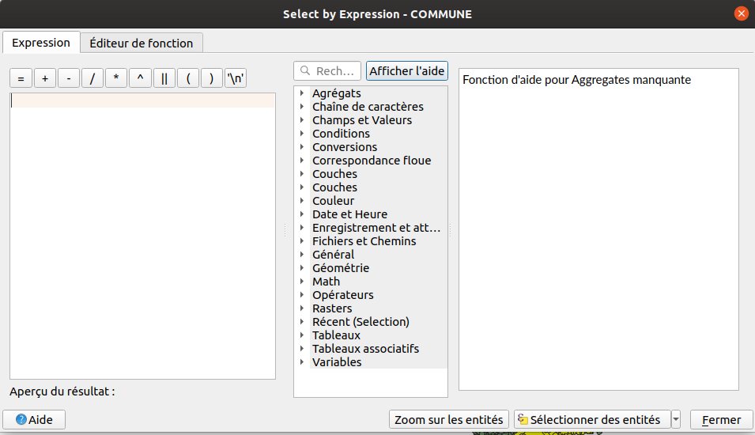

# Fonctions sur une couche vecteur

## Boucler sur les entités d'une couche sans expression

On peut parcourir les entités d'une couche `QgsVectorLayer` à l'aide de `getFeatures()` :

```python
from qgis.utils import iface

layer = iface.activeLayer()
for feature in layer.getFeatures():
    print(feature)
    print(feature['NOM'])
```

## Utilisation des expressions QGIS

* Les expressions sont très présentes dans QGIS, tant dans l'interface graphique que dans l'utilisation en
  Python.
* Nous partons de la couche des `COMMUNES` uniquement chargé dans QGIS.

## Sélection d'entité

Nous souhaitons sélectionner les entités dont le code INSEE commence par `77`.
Commençons par faire cela graphiquement dans QGIS Bureautique. À l'aide d'une expression QGIS, sélectionner
les codes INSEE qui commencent par `77` (à choisir un code INSEE propre au jeu de données).



Solution en mode graphique :

```sql
"INSEE_COM" LIKE '77%'
```

Nous allons faire la même chose, mais en utilisant Python. Pensez à **désélectionner** les entités.

```python
from qgis.utils import iface

layer = iface.activeLayer()
layer.removeSelection()
layer.selectByExpression(f"\"INSEE_COM\" LIKE '77%'")
layer.invertSelection()
layer.removeSelection()
```

Le raccourci `iface.activeLayer()` est très pratique, mais de temps en temps, on a besoin de **plusieurs** couches qui
sont déjà dans la légende. Il existe dans `QgsProject` plusieurs méthodes pour récupérer des couches dans la légende :

```python
from qgis.core import QgsProject

projet = QgsProject.instance()
communes = projet.mapLayersByName('communes')[0]
insee = projet.mapLayersByName('tableau INSEE')
```


Notons le **s** dans `mapLayersByName`. Il peut y avoir plusieurs couches avec ce même nom de couche. La fonction retourne
donc une liste de couches. Il convient alors de regarder si la liste est vide ou si elle contient plusieurs couches avec
`len(communes)` par exemple.

!!! warning
    `mapLayersByName` fait uniquement une recherche stricte, sensible à la casse. Il faut passer par du
    code Python "pure" en itérant sur l'ensemble des couches, indépendamment de leur nom si l'on souhaite faire une
    recherche plus fine. Si vraiment on a besoin, on peut utiliser le module [re](https://docs.python.org/3/library/re.html)
    (lien du [Docteur Python](https://python.doctor/page-expressions-regulieres-regular-python)).

```python
from qgis.core import QgsProject

projet = QgsProject.instance()
communes = projet.mapLayersByName('communes')[0]

if len(communes) == 0:
    print("Pas de couches dans la légende qui se nomme 'communes'")
    layer = None
elif len(communes) >= 1:
    # TODO FIX ME, pas forcément la bonne couche 'communes'
    layer = communes[0]
```

### Exemple d'une sélection avec un export

On souhaite pouvoir exporter les communes par département.
On peut créer une variable `depts = ('34', '30')` puis boucler dessus pour exporter les entités sélectionnées dans
un nouveau fichier.


```python
from pathlib import Path
from qgis.core import QgsProject, QgsVectorFileWriter
from qgis.utils import iface

layer = iface.activeLayer()

options = QgsVectorFileWriter.SaveVectorOptions()
options.driverName = 'ESRI Shapefile'
options.fileEncoding = 'UTF-8'
options.onlySelectedFeatures = True  # Nouvelle option pour la sélection

depts = ('34', '30')
for dept in depts:
    print(f"Dept {dept}")
    layer.selectByExpression(f"\"INSEE_DEP\"  =  '{dept}'")
    result = QgsVectorFileWriter.writeAsVectorFormatV3(
        layer,
        str(Path(QgsProject.instance().homePath()).joinpath(f'{dept}.shp')),
        QgsProject.instance().transformContext(),
        options
    )
    print(result)
    if result[0] == QgsVectorFileWriter.NoError:
        print(" → OK")
```

!!! tip "Bonus"
    Si l'on souhaite parcourir automatiquement les départements existants, on peut récupérer les valeurs uniques. Pour cela,
    il faut modifier deux lignes :

    ```python
    index = layer.fields().indexFromName("INSEE_DEP")
    for dept in layer.uniqueValues(index):
    ```

## Boucler sur les entités à l'aide d'une expression

L'objectif est d'afficher dans la console le nom des communes dont la population ne contient pas `NC`.

!!! info
    Avec PyQGIS, on peut accéder aux attributs d'une `QgsFeature` simplement avec l'opérateur `[]` sur
    l'objet courant comme s'il s'agissait d'un dictionnaire Python :

    ```python
    # Pour accéder au champ "NOM" de l'entité "feature" :
    print(feature['NOM'])
    ```

    On peut le voir dans les exemples `attribute` de QgsFeature : https://qgis.org/pyqgis/3.34/core/QgsFeature.html#qgis.core.QgsFeature.attribute

L'exemple à **ne pas** faire, même si cela fonctionne (car on peut l'optimiser très facilement) :

1. Imaginons une couche PostgreSQL
2. On demande à QGIS de récupérer l'ensemble de la table distante, équivalent à `SELECT * FROM ma_table`
3. **Puis**, on filtre dans QGIS (toute la données est présente dans QGIS Bureautique désormais)

```python
from qgis.utils import iface

layer = iface.activeLayer()
for feature in layer.getFeatures():
    if feature['POPULATION'] != 'NC':
        print(feature['NOM'])
```

!!! tip
    Ce qui prend du temps lors de l'exécution, c'est surtout le `print` en lui-même.
    Si vous n'utilisez pas `print`, mais un autre traitement, cela sera plus rapide.
    Un simple print ralenti l'exécution d'un script.

### Optimisation de la requête

Dans la documentation, observez bien la signature de la fonction `getFeatures`. Que remarquez-vous ?
Utilisons donc une expression pour limiter les résultats.

```python
from qgis.utils import iface
from qgis.core import QgsFeatureRequest

layer = iface.activeLayer()

request = QgsFeatureRequest()
# Équivalent à SELECT * FROM ma_table WHERE "POPULATION" != 'NC'
request.setFilterExpression('"POPULATION" != \'NC\'')

for feature in layer.getFeatures(request):
    print(f'{feature['NOM']} : {feature['POPULATION']} habitants pour')
```

Nous pouvons accessoirement ordonner les résultats et surtout encore optimiser la requête en :

  * Ne demandant pas de charger la géométrie
  * Ne demandant pas de charger tous les attributs

??? "La solution pour les experts"
    ```python
    request = QgsFeatureRequest()
    request.setFilterExpression('"POPULATION" != \'NC\'')
    request.addOrderBy('NOM')
    request.setFlags(QgsFeatureRequest.NoGeometry)
    # request.setSubsetOfAttributes([1, 4]) autre manière moins pratique, historique
    request.setSubsetOfAttributes(['NOM', 'POPULATION'], layer.fields())
    # # Équivalent à SELECT NOM, POPULATION FROM ma_table WHERE "POPULATION" != 'NC' ORDER BY NOM
    for feature in layer.getFeatures(request):
        print('{commune} : {nombre} habitants'.format(commune=feature['NOM'], nombre=feature['POPULATION']))
    ```

    * Faire le test en affichant un champ qui n'est pas dans la requête.

Si l'on souhaite "enregistrer" le résultat de cette expression QGIS, on peut la *matérialiser* dans une
nouvelle couche :

```python
memory_layer = layer.materialize(request)
QgsProject.instance().addMapLayer(memory_layer)
```

!!! warning
    Attention à la ligne iface.activeLayer() qui peut changer lors de l'ajout
    d'une nouvelle couche dans la légende.

Regardons le résultat et corrigeons ce problème d'export afin d'obtenir les géométries et les attributs,
il faut **supprimer** la ligne `NoGeometry` si vous l'avez.

## Valeur NULL

En PyQGIS, il existe la valeur `NULL` qui peut être présente dans la table attributaire d'une couche vecteur.

```python
from qgis.PyQt.QtCore import NULL

if feature['nom_attribut'] == NULL:
    # Traiter la valeur NULL
    pass
else:
    # Continuer
    pass
```

## Calculer un champ "densite"

Nous souhaitons avoir une colonne `densite` dans notre table attributaire, avec la densité de population.

Mais regardons avant la gestion des erreurs lors d'un traitement. En effet, nous allons
vouloir "caster" (transformer le type) de la variable `population` en entier, mais attention,
il y a des valeurs `NC` dans les valeurs.

## Les exceptions en Python

Avant de traiter cet exercice, nous devons voir ce qu'est une **exception** en Python.

À plusieurs reprises depuis le début de la formation, il est fort à parier que nous ayons des messages en
rouges dans la console de temps en temps. Ce sont des exceptions. C'est une notion de programmation qui existe
dans beaucoup de languages.

Dans le langage informatique, une exception peut-être :

* levée ("raise" en anglais) pour déclencher une erreur
* attrapée ("catch" en anglais, ou plutôt "except" en Python) pour traiter l'erreur

Essayons dans la **console** de faire une opération 10 / 2 :

```python
10 / 2
```

Essayons cette fois-ci 10 / 0, ce qui est mathématiquement impossible :
```python
10 / 0
```

Passons cette fois-ci dans un **script** pour que cela soit plus simple, et voir que le script s'arrête brutalement 😉

```python
print('Début')
print(10 / 0)
print('Fin')
```

On peut "attraper" cette erreur Python à l'aide d'un `try ... except...` :

```python
print('Début')
try:
    print(10 / 2)
except ZeroDivisionError:
    print('Ceci est une division par zéro !')
print('Fin')
```

Le `try` permet d'essayer le code qui suit. Le `except` permet d'attraper en filtrant s'il y a des exceptions
et de traiter l'erreur si besoin.

!!! tip
    On peut avoir une ou plusieurs lignes de code dans chacun de ces blocs. On peut appeler des fonctions, etc.

### Une exception remonte le fil d'exécution du programme

**Important**, une exception **remonte** tant qu'elle n'est pas **attrapée** : 

```python
def function_3():
    print("Début fonction 3")
    a = 10
    b = 0
    print(f"→ {a} / {b} = {a/b}")
    print("Fin fonction 3")

def function_2():
    print("Début fonction 2")
    function_3()
    print("Fin fonction 2")

def function_1():
    print("Début fonction 1")
    function_2()
    print("Fin fonction 1")
    
function_1()
```

On voit que Python, quand il peut, nous indique la "stacktrace" ou encore "traceback",
c'est-à-dire une sorte de fil d'ariane.

### Héritage des exceptions

Toutes les exceptions héritent de `Exception` donc le code ci-dessous fonctionne, mais n'est pas
recommandé, car il masque d'autres erreurs :

```python
try:
    print(10 / 2)
except Exception:
    print('Erreur inconnue')
```

On peut par contre "enchaîner" les exceptions, afin de filtrer progressivement les exceptions.

```python
try:
    print(10 / 0)
except ZeroDivisionError:
    print('Erreur, division par 0')
except Exception:
    print('Erreur inconnue')
```

Il existe d'autres mots-clés en Python pour les exceptions comme `finally:` et `else:`.
Voir [un autre tutoriel](https://fr.python-3.com/?p=3141).

On peut imaginer faire une fonction qui divise deux nombres et affiche le résultat 
dans la `QgsMessageBar` de QGIS, sans tenir compte de la division par zéro :

```python
def diviser(a: int, b: int):
    """ Divise 2 nombres et affiche le résultat dans la "message bar" de QGIS. """
    result = a / b
    iface.messageBar().pushMessage('Résultat', f'{a} / {b} = {result}', Qgis.Success)
    
diviser(10, 0)
```

En tenant compte d'une possible erreur lors de l'opération mathématique :

```python
def diviser(a: int, b: int):
    try:
        result = a / b
    except ZeroDivisionError:
        iface.messageBar().pushMessage('Division par 0', f'{a} / {b} est impossible', Qgis.Warning)
    else:
        iface.messageBar().pushMessage('Résultat', f'{a} / {b} = {result}', Qgis.Success)
    
diviser(10, 2)
```

Évidement, on peut vérifier la valeur de `b` en amont si c'est égal à 0. Mais ceci est pour présenter le
concept des exceptions en Python.

## Retour à l'exercice

On souhaite donc savoir si un nombre est transformable en entier, dans le cas de la
population (s'il y a `NC` par exemple) :

```python
int('10')
int('NC')
```

Correction possible de l'exercice :

```python
from qgis.utils import iface
from qgis.core import QgsFeatureRequest

layer = iface.activeLayer()
request = QgsFeatureRequest()
# request.setLimit(5)  # Pour aller plus vite si-besoin
request.addOrderBy('NOM')
request.setSubsetOfAttributes(['NOM', 'POPULATION'], layer.fields())
for feature in layer.getFeatures(request):
    area = feature.geometry().area() / 1000000
    try:
        population = int(feature['POPULATION'])
    except ValueError:
        population = 0
    print('{commune} : {densite} habitants/km²'.format(commune=feature['NOM'], densite=population/area))
```

Nous souhaitons enregistrer ces informations dans une vraie table avec un nouveau champ `densite_population`.

Solution plus simple :

```python
from qgis.utils import iface
from qgis.core import QgsFeatureRequest, QgsField, edit

from qgis.PyQt.QtCore import QVariant

layer = iface.activeLayer()

if 'densite' not in layer.fields().names():
    with edit(layer):
        field = QgsField('densite', QVariant.Double, prec=2, len=2)
        layer.addAttribute(field)

index = layer.fields().indexFromName('densite')
layer.startEditing()
request = QgsFeatureRequest()
# request.setLimit(5)  # Pour aller plus vite si-besoin
request.addOrderBy('NOM')
request.setSubsetOfAttributes(['NOM', 'POPULATION'], layer.fields())
for feature in layer.getFeatures(request):
    area = feature.geometry().area() / 1000000
    try:
        population = int(feature['POPULATION'])
    except ValueError:
        population = 0
    
    densite = population/area

    # Cette ligne n'aura aucun effet
    feature['densite'] = densite

    # Uniquement l'appel à "changeAttributeValue" fonctionne
    # Pour information, il existe "changeGeometry" pour la même raison
    layer.changeAttributeValue(feature.id(), index, densite)
    # print('{commune} : {densite} habitants/km²'.format(commune=feature['NOM'], densite=round(population/area,2)))

layer.commitChanges()
```

## Calculer deux champs en utilisant la géométrie et une reprojection à la volée

Manipulons désormais la géométrie en ajoutant le centroïde de la commune dans une colonne `latitude` et
`longitude` en degrées.

!!! warning
    TODO, en cours de correction, suppression de la variable `petite_communes`

```python
from qgis.utils import iface
from qgis.core import QgsFeatureRequest, QgsField, edit

layer = iface.activeLayer()

request = QgsFeatureRequest()
request.setFilterExpression('to_int( "POPULATION" ) < 1000')
petites_communes = layer.materialize(request)

with edit(petites_communes):
    petites_communes.addAttribute(QgsField('densite_population', QVariant.Double))

    # /!\ Ajouter les 2 lignes ci-dessous
    petites_communes.addAttribute(QgsField('longitude', QVariant.Double))
    petites_communes.addAttribute(QgsField('latitude', QVariant.Double))

request = QgsFeatureRequest()
request.setSubsetOfAttributes([4])

# /!\ Ajouter les 2 lignes ci-dessous à propos de la transformation
transform = QgsCoordinateTransform(
    QgsCoordinateReferenceSystem("EPSG:2154"), QgsCoordinateReferenceSystem("EPSG:4326"), QgsProject.instance())

with edit(petites_communes):
    for feature in petites_communes.getFeatures(request):
        area = feature.geometry().area() / 1000000
        population = int(feature['POPULATION'])
        densite=population/area
        petites_communes.changeAttributeValue(feature.id(), 5, densite)
        
        # /!\ Ajouter les lignes ci-dessous
        geom = feature.geometry()
        # La transformation affecte directement l'objet Python en cours, mais pas l'entité dans la couche
        geom.transform(transform)
        centroid = geom.centroid().asPoint()
        petites_communes.changeAttributeValue(feature.id(), 6, centroid.x())
        petites_communes.changeAttributeValue(feature.id(), 7, centroid.y())

QgsProject.instance().addMapLayer(petites_communes)
```
