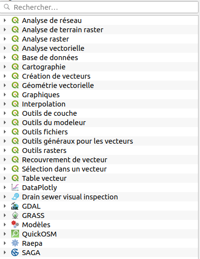

# Librairie QGIS

## QGIS Process

Depuis QGIS 3.16, il existe un outil [qgis_process](https://docs.qgis.org/latest/fr/docs/user_manual/processing/standalone.html)
qui permet de lancer QGIS Processing en ligne de commande.

Quelques rappels pour utiliser la ligne de commande sous Windows :

* `cd` pour *C**hange **D**irectory. Par exemple `cd C:/Program Files/QGIS 3.34/bin/`
* `dir` pour lister les fichiers/dossiers d'un répertoire

Dans le **shell OSGEO**, taper :

```bash
cd C:/Program Files/QGIS 3.14/bin/
# Il peut s'agit du chemin ci-dessous
cd C:\OSGeo4W\apps\qgis-ltr\bin\
```

On doit avoir désormais un exécutable `qgis_process-qgis-ltr.bat`

```bash
qgis_process-qgis-ltr.bat
qgis_process-qgis-ltr.bat --help
qgis_process-qgis-ltr.bat list
```

On peut lancer les algorithmes, les modèles, les scripts Python qui sont dans la version graphique de QGIS Processing.

On peut donc lancer en ligne de commande, ou alors avec notre propre icône sur son bureau un exécutable.

```bash
qgis_process help qgis:buffer
qgis_process run qgis:buffer -- INPUT=/home/etienne/source.shp DISTANCE=2 OUTPUT=/tmp/sortie.gpkg
```

L'idée de QGIS Process est soit de faire un petit exécutable ou alors de lancer le programme à intervalle de temps régulier.



## Standalone application

Il est possible de faire un programme qui **ne se lance** pas dans QGIS Bureautique mais qui **utilise**
la librairie QGIS qui se trouve sur l'ordinateur.

!!! warning
    Grâce à `qgis_process`, c'est exemple d'application **standalone** perd la plupart de son intérêt.
    Pour lancer QGIS en ligne de commande pour faire des traitements, il est **désormais fortement** conseillé
    d'utiliser `qgis_process`.

On peut donc créer son propre programme, en ligne de commande ou avec une interface graphique qui utilise le
**moteur** de QGIS en arrière-plan pour utiliser ce que sait déjà faire QGIS.

Exemple sur le [gist de Thomas Gratier](https://gist.github.com/ThomasG77/f711853e5fb81c746d2a1af0b2a9ecf5)

```python
# Code borrowed from https://subscription.packtpub.com/book/application_development/9781783984985/1/ch01lvl1sec18/creating-a-standalone-application
# and upgraded for QGIS 3.0
import os
import sys
import shutil
import tempfile
import urllib.request
from zipfile import ZipFile
from glob import glob

from qgis.core import (QgsApplication, QgsCoordinateReferenceSystem, QgsFeature,
	               QgsGeometry, QgsProject, QgsRasterLayer, QgsVectorLayer)
from qgis.gui import QgsLayerTreeMapCanvasBridge, QgsMapCanvas
from qgis.PyQt.QtCore import Qt
# Unused so commented
# from qgis.PyQt.QtGui import *

app = QgsApplication([], True)
# On Windows : https://gis.stackexchange.com/questions/334172/creating-standalone-application-in-qgis
# On Linux, didn't need to set it so commented
# app.setPrefixPath("C:/Program Files/QGIS Brighton/apps/qgis", True)
app.initQgis()
canvas = QgsMapCanvas()
canvas.setWindowTitle("PyQGIS Standalone Application Example")
canvas.setCanvasColor(Qt.white)
crs = QgsCoordinateReferenceSystem('EPSG:3857')
project = QgsProject.instance()
canvas.setDestinationCrs(crs)

urlWithParams = 'type=xyz&url=https://a.tile.openstreetmap.org/%7Bz%7D/%7Bx%7D/%7By%7D.png&zmax=19&zmin=0&crs=EPSG3857'
rlayer2 = QgsRasterLayer(urlWithParams, 'OpenStreetMap', 'wms')

if rlayer2.isValid():
    project.addMapLayer(rlayer2)
else:
    print('invalid layer')

# Download shp ne_10m_admin_0_countries.shp and associated files in the same directory
url = "https://www.naturalearthdata.com/http//www.naturalearthdata.com/download/10m/cultural/ne_10m_admin_0_countries.zip"
if not glob("ne_10m_admin_0_countries.*"):
    with urllib.request.urlopen(url) as response:
        with tempfile.NamedTemporaryFile(delete=False) as tmp_file:
            shutil.copyfileobj(response, tmp_file)
        with ZipFile(tmp_file.name, 'r') as zipObj:
            # Extract all the contents of zip file in current directory
            zipObj.extractall()

layer_shp = QgsVectorLayer(os.path.join(os.path.dirname(__file__), "ne_10m_admin_0_countries.shp"), "Natural Earth", "ogr")
if not layer_shp.isValid():
  print("Layer failed to load!")

project.addMapLayer(layer_shp)

print(layer_shp.crs().authid())
print(rlayer2.crs().authid())
canvas.setExtent(layer_shp.extent())
canvas.setLayers([rlayer2, layer_shp])
canvas.zoomToFullExtent()
# canvas.freeze(True)
canvas.show()
canvas.refresh()
# canvas.freeze(False)
canvas.repaint()
bridge = QgsLayerTreeMapCanvasBridge(
    project.layerTreeRoot(),
    canvas
)

def run_when_project_saved():
    print('Saved')

project.projectSaved.connect(run_when_project_saved)

project.write('my_new_qgis_project.qgz')

def run_when_application_state_changed(state):
    print('State changed', state)

app.applicationStateChanged.connect(run_when_application_state_changed)

exitcode = app.exec()
QgsApplication.exitQgis()
sys.exit(True)
```
