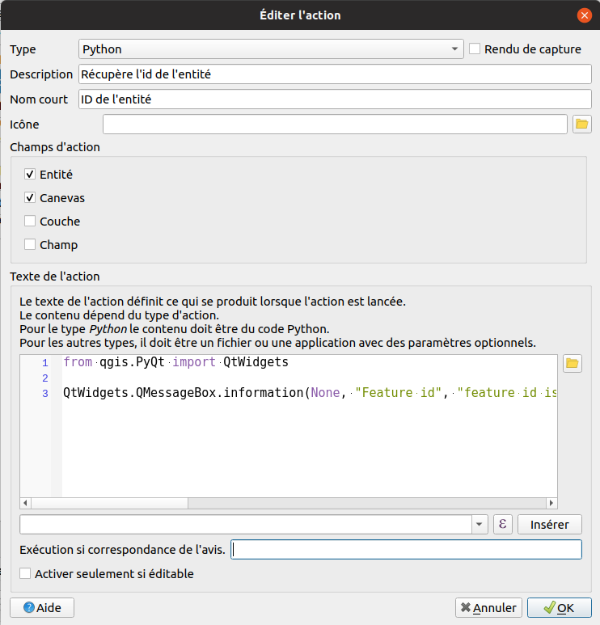

# Le python dans QGIS

QGIS permet d'utiliser du Python dans divers emplacements. Les

## Console

La console est accessible par le menu `Extension` -> `Console Python`.

## Script Python

L'éditeur de script Python est accessible depuis l'icône dedié dans la console Python. Il permet un prototypage rapide d'un script.

## Script Processing

Le menu Traitement dans QGIS donne accès a plusieurs algorithmes d'analyse. 
La boîte à outils de traitements ainsi que le modeleur graohique utilisent le framework Processing propre à QGIS.
Il permet de définir les entrées, les sorties d'un algorithme. Le framework peut aussi générer automatiquement 
l'interface graphique de l'algorithme.
Écrire un script processing permet l'intégration dans ce menu, permet l'utilisation de ce-dernier dans un modèle 
ou encore l'utilisation en mode traitement par lot.

Il existe un modèle par défaut, depuis la barre d'outil traitements, `Créer un nouveau script depuis un modèle.`

## Fournisseur Processing

Similaire au script Processing, une extension QGIS peut aussi avoir son propre fournisseur d'algorithme.

On peut remarquer les plugins `DataPlotly`, `QuickOSM` etc.

## Expressions

## Macros

## Actions

## Formulaire

## Application/script indépendant

Sans lancer QGIS graphiquement, on peut utiliser la librairie QGIS, soit sous la forme d'un script, en ligne de commande, 
ou alors reprogrammer une application spécifique.

## startup.py

Lancement d'un fichier automatiquement au chargement de QGIS.